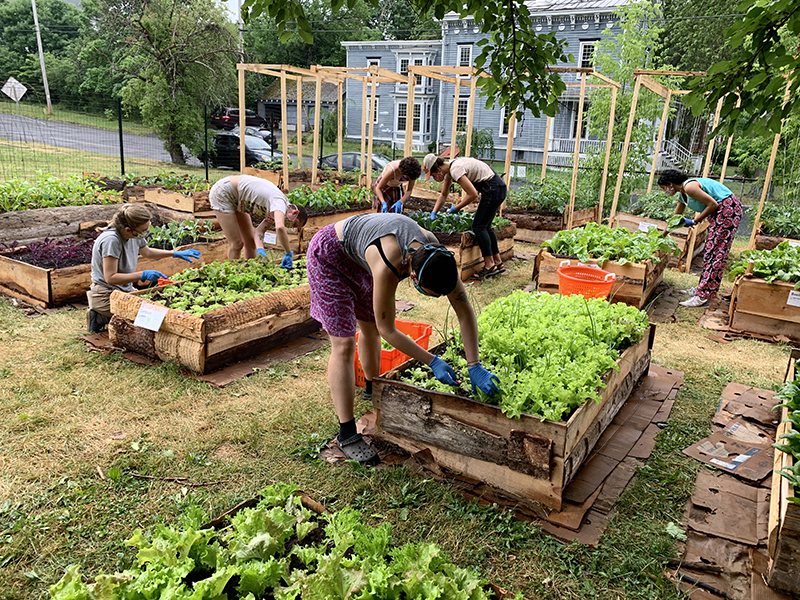
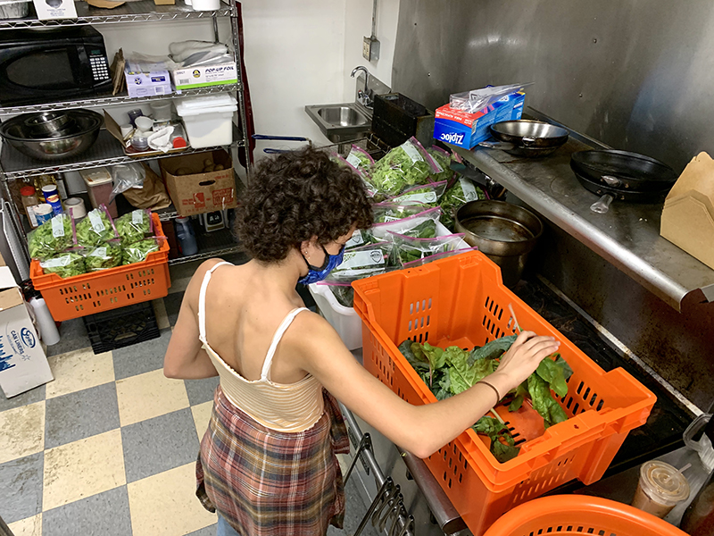
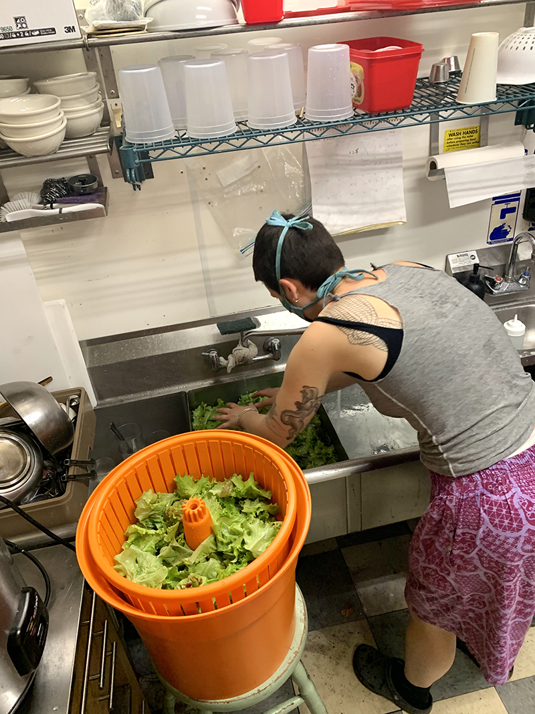
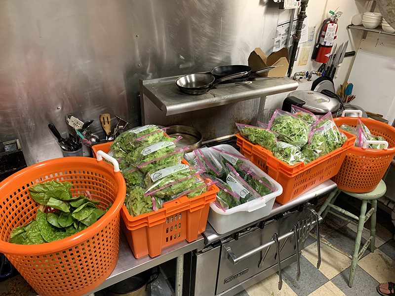

Well, here it is! Our first full harvest of the season, donated to the Catskill Community Center Food Shelf.

We donated 32 bags of lettuce mix, 13 bags of spinach, 6 bags of loose kale & chard, and 6 bunches of chard.

Big thanks to everyone who came out to harvest, wash and pack - a truly stellar team.

And thanks to the Avalon Lounge, for allowing us to use their commercial kitchen.

Most importantly, each CCC Food Shelf recipient was able to receive three bags of greens apiece. Let's keep this going!