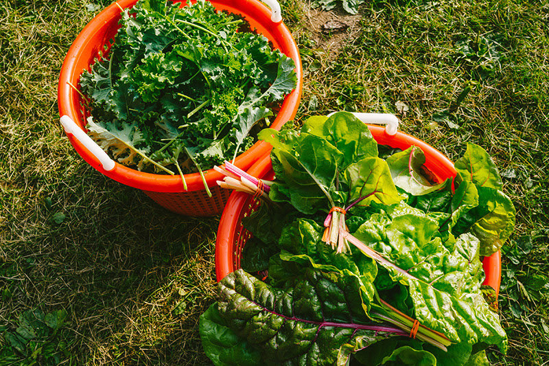
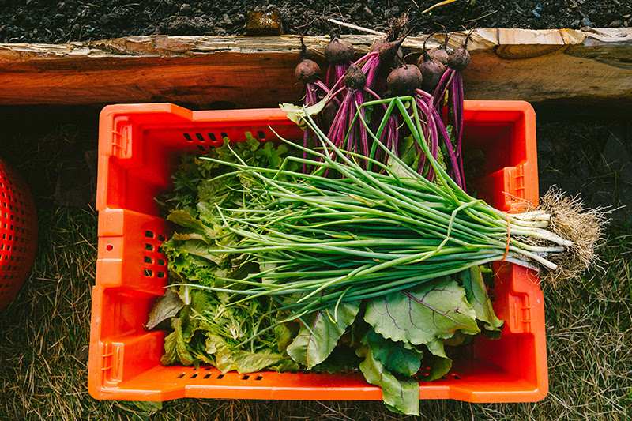
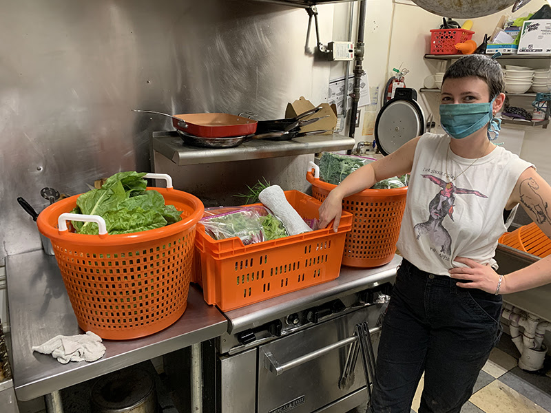

Our second harvest is complete!

We donated 15 bunches of chard, 12 bags of kale, 5 bags of beet greens, and 8 bags of lettuce mix to the Catskill Community Center Food Shelf - enough greens to supply each of their 15 weekly boxes with multiple fresh produce items.

