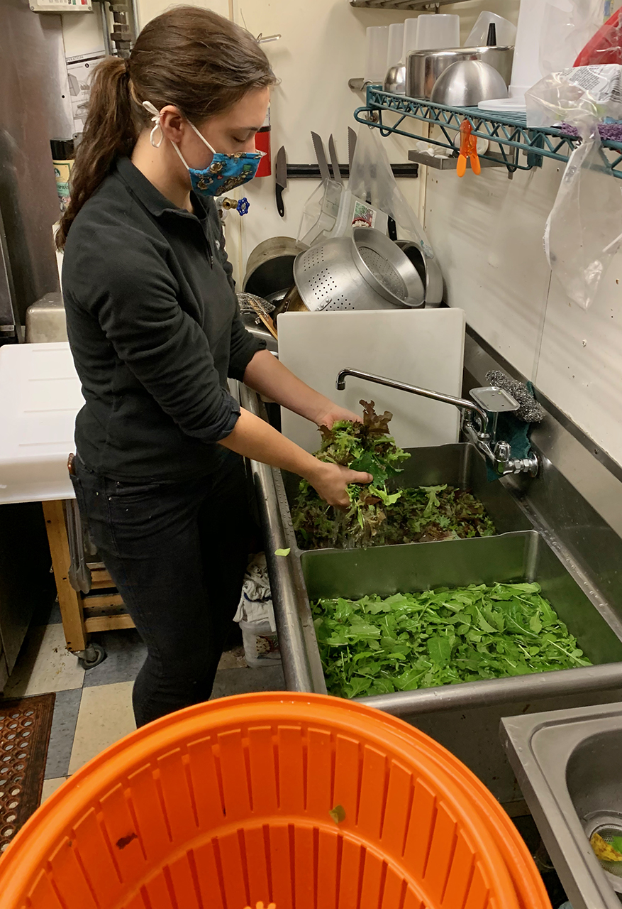

We donated Harvest #18 to the [Catskill Food Pantry](catskillfoodpantry.org) this past Wednesday

27 bunches kale

13 bags micro greens

There are probably only 2-3 more harvests left for this season. We will be harvesting kale and collards on alternating weeks, and micro greens each week. We will go until the plants stop producing! Starting in early November, there won't be enough sunlight for them to keep regrowing, and our harvesting will end for the season.

