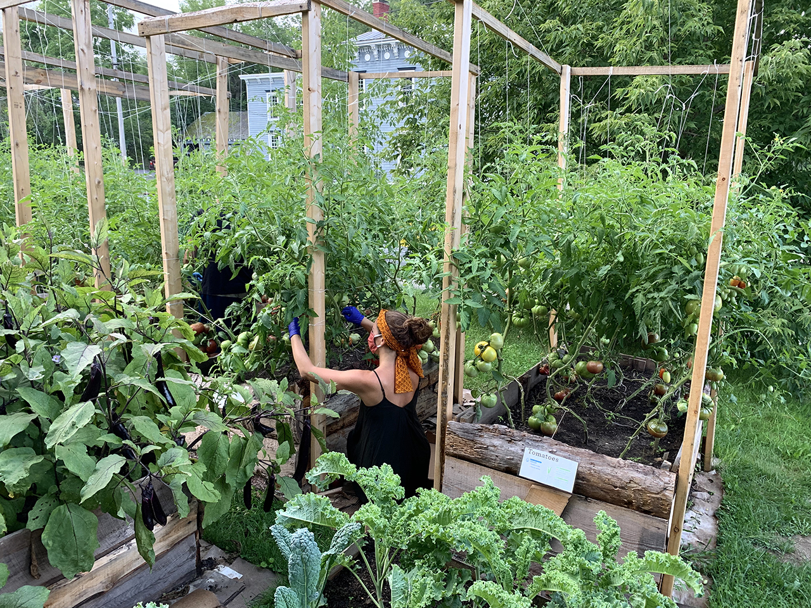
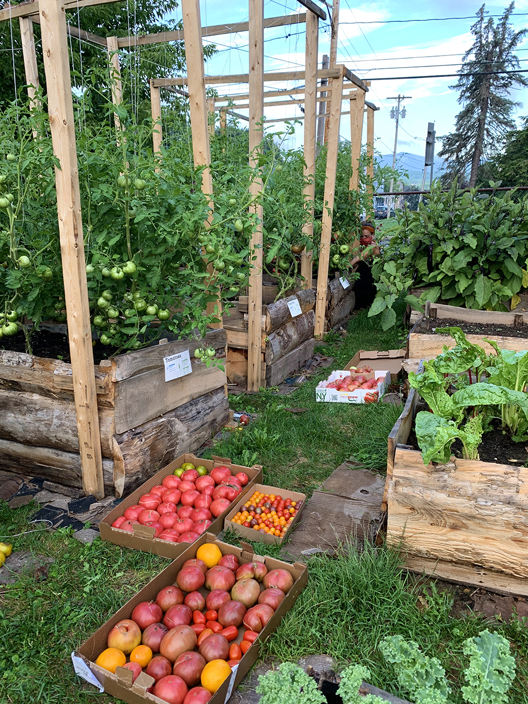
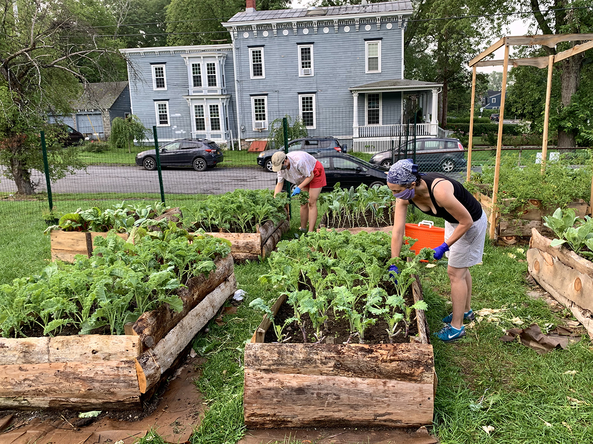
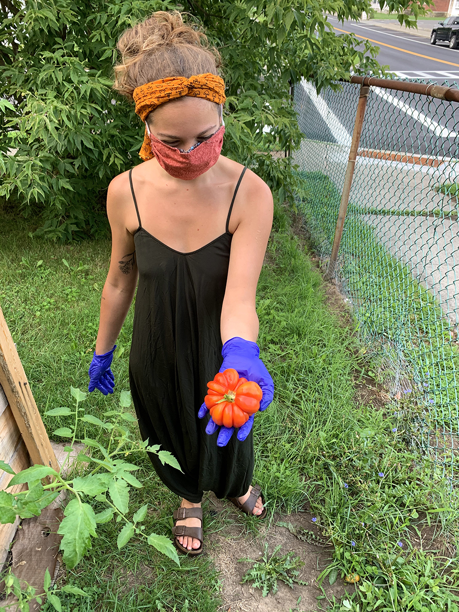
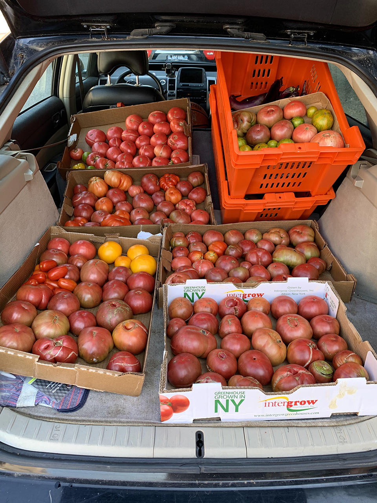
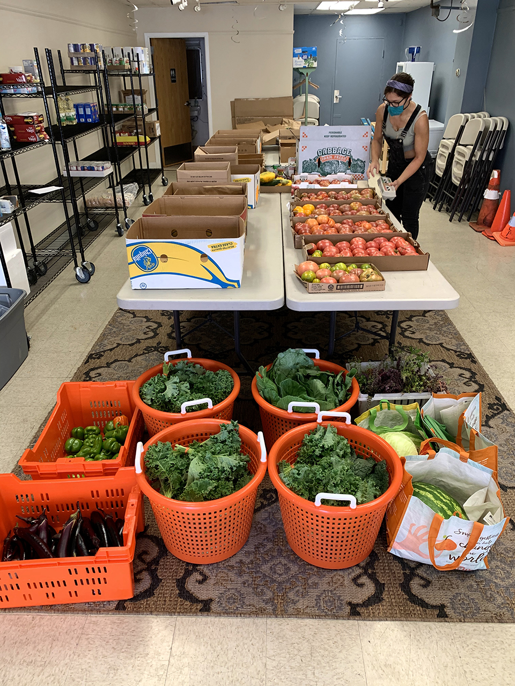

The tomato jungle has fully ripened!

Yesterday's harvest, donated to the [Catskill Community Center Food Shelf](https://ccmicrofarm.us18.list-manage.com/track/click?u=94746e6c6b5541022831953dd&id=5882738db8&e=ef559ba078):

**43 bunches kale\
13 bunches collards\
37 lbs. tomatoes\
17 lbs. eggplant\
11 lbs. peppers\
20 lbs. gleaned peaches**

