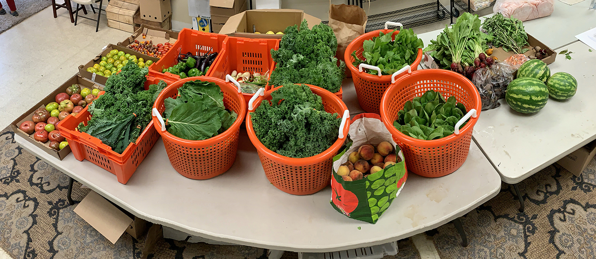

We have donated our 11th harvest to the Catskill Community Center Food Shelf! Next week will be our last donation at the Community Center, as the building closes and a new food pantry forms - detailed updates below.

At this point, our donations have been enough to supply between 20-25 families a week with fresh food. Donated to the **Catskill Community Food Shelf** yesterday:

**56 bunches kale\
18 bunches collards\
22 lbs. tomatoes\
17 lbs. peppers\
15 lbs. eggplant\
12 bunches scallions**

**Donated from 2 other local farm gardens:\
10 heads bac choi\
8 bunches beets + 10 lbs. loose beets\
10 bunches radishes\
16 lbs. peaches\
3 watermelons, sliced and bagged**

**Food Pantry Updates**

\
As many of you know, the Catskill Community Center's Food Pantry has officially closed. Megan Henry, who has been coordinating, is forming a new project - and we are happy to continue to donate to her effort! The new pantry will be called the [Catskill Food Pantry](http://catskillfoodpantry.org), and will be located at St. Luke's Episcopal Church on William Street.\
\
The Community Center board has generously donated its food storage and distribution infrastructure to Megan, and we are hoping to help her set it up at the end of next week. More info on a work day to come!\
\
**Next Wednesday, the 9th will be our last donation at the Community Center. Wednesday the 16th will be our first donation to the Catskill Food Pantry.**

