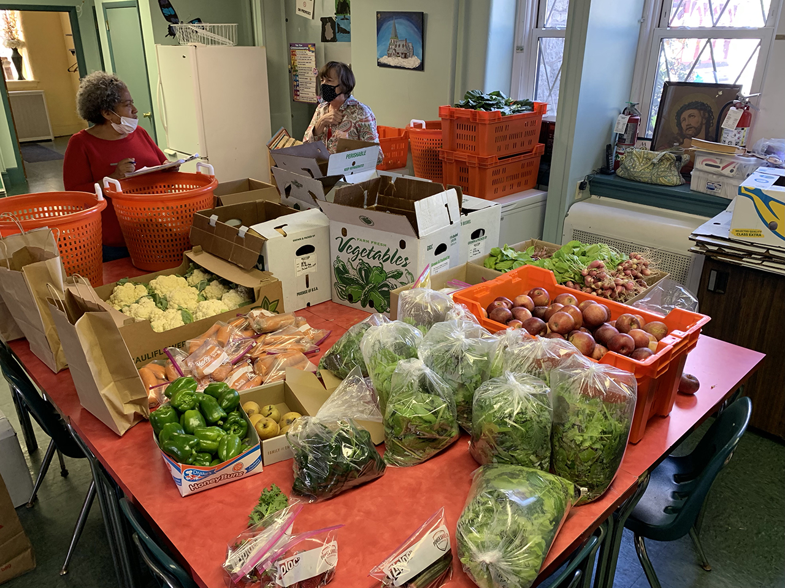
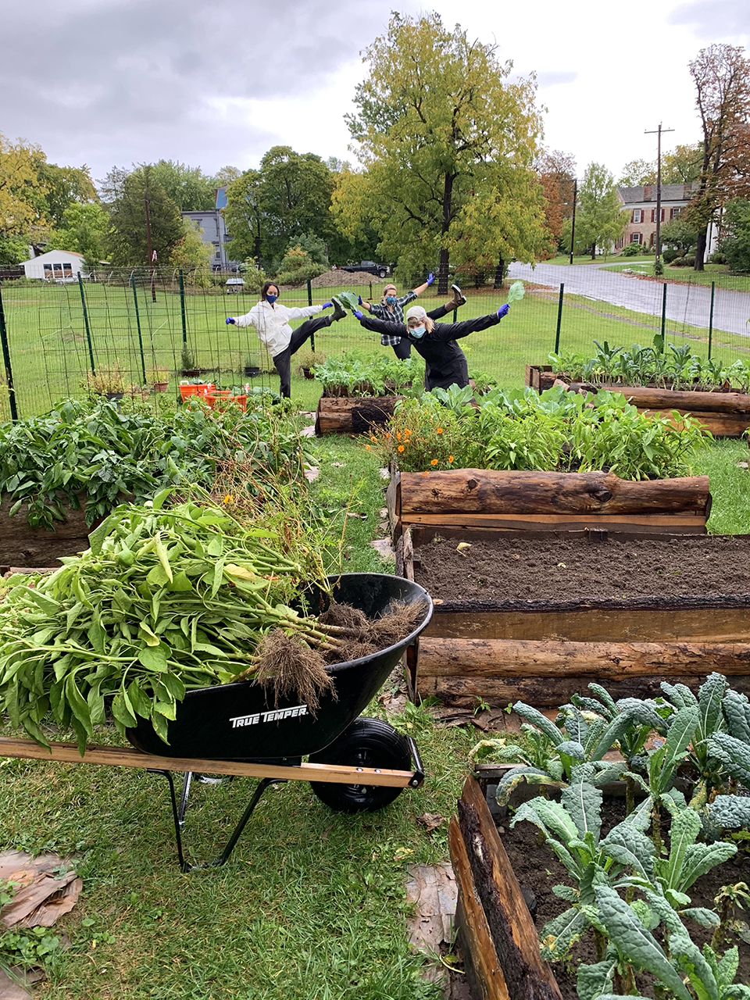
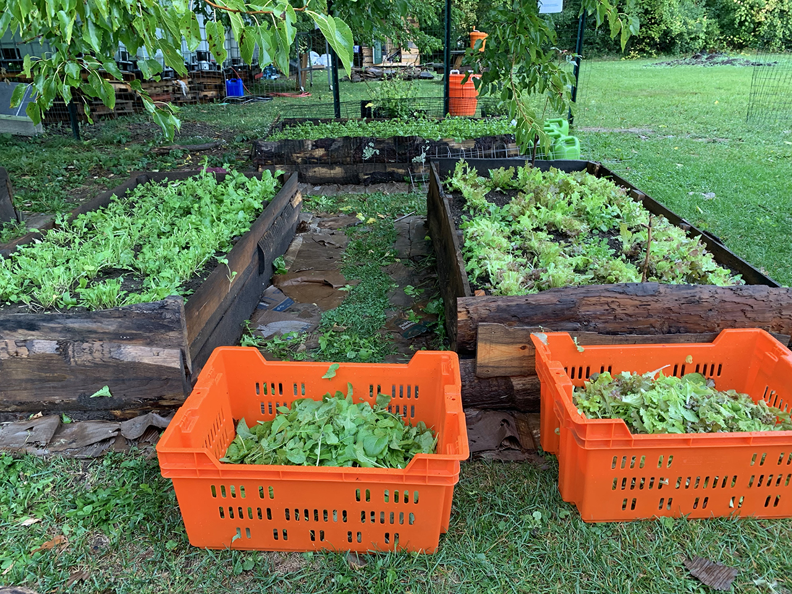
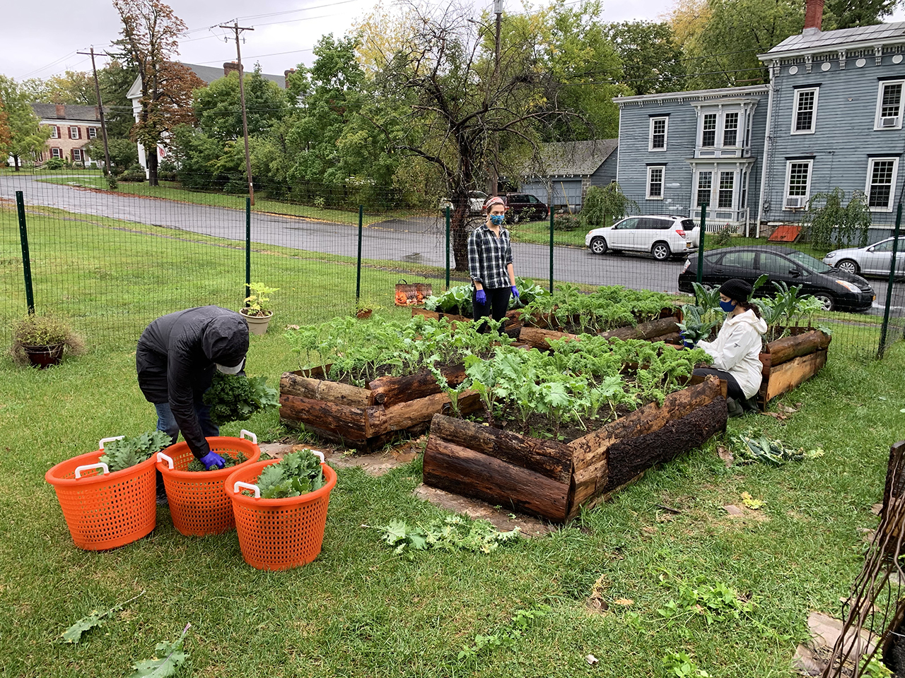

We completed our 15th harvest! Donated to the [Catskill Food Pantry](catskillfoodpantry.org):

**32 bunches kale**

**28 bunches collards**

**24 bags micro greens**

**10 lbs. peppers**

**8 lbs. tomatoes**

**26 lbs. apples**

For this past growing season, this has been donating produce, first to the Catskill Community Center Food Shelf, and now the newly formed Catskill Food Pantry (CFP). CFP is a separate entity from the Community Center, founded by Megan Henry to continue and expand the mission of the Community Center's pantry.

In order to continue through the winter, the Catskill Food Pantry is in need of funds for an immediate operating budget.\
**They are raising $6,000 through GoFundMe - [here is the link](https://ccmicrofarm.us18.list-manage.com/track/click?u=94746e6c6b5541022831953dd&id=7c80c72455&e=ef559ba078). Please read the fundraiser details, share with others, and give what you can!**

To boost the exposure of both CFP and CCMF, we have decided to partner on an event at the micro farm. The Fall Harvest Gathering will have tables with CFP and CCMF representatives, farm tours, info session on food insecurity in Greene County, and family-friendly activities. We can't wait!

