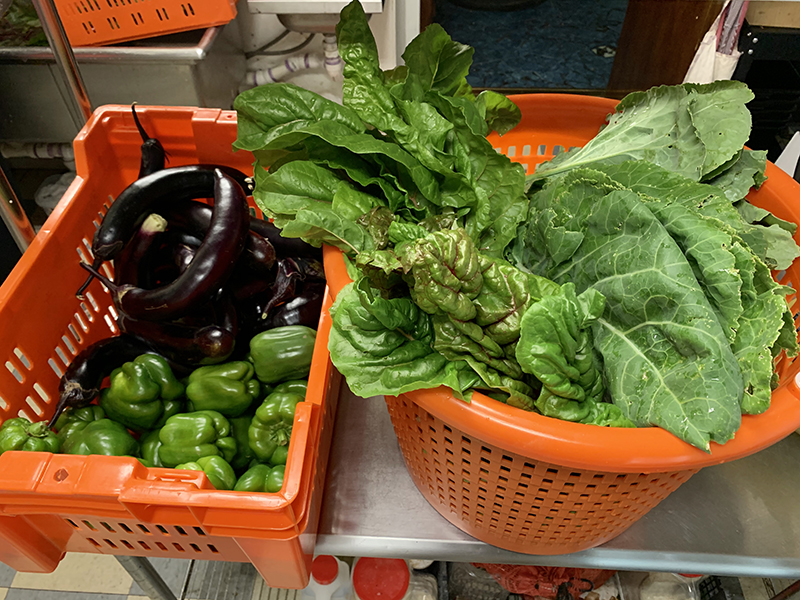
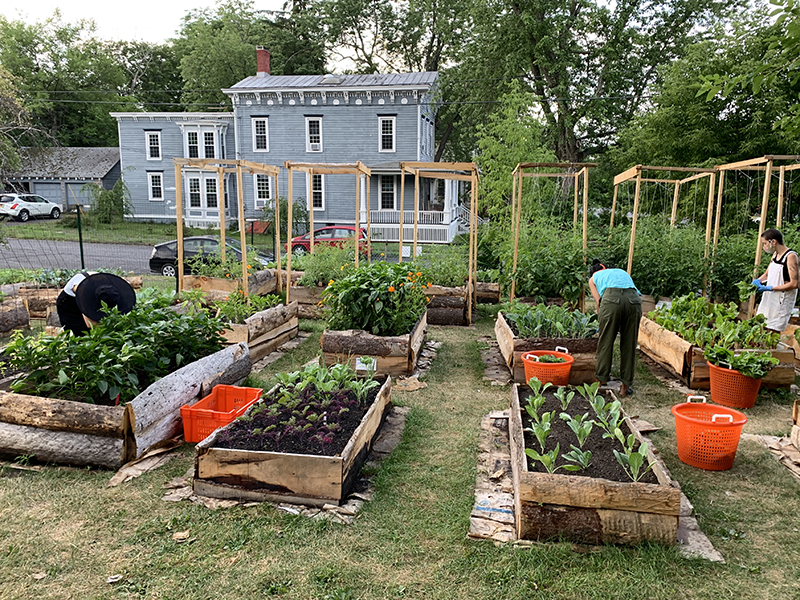
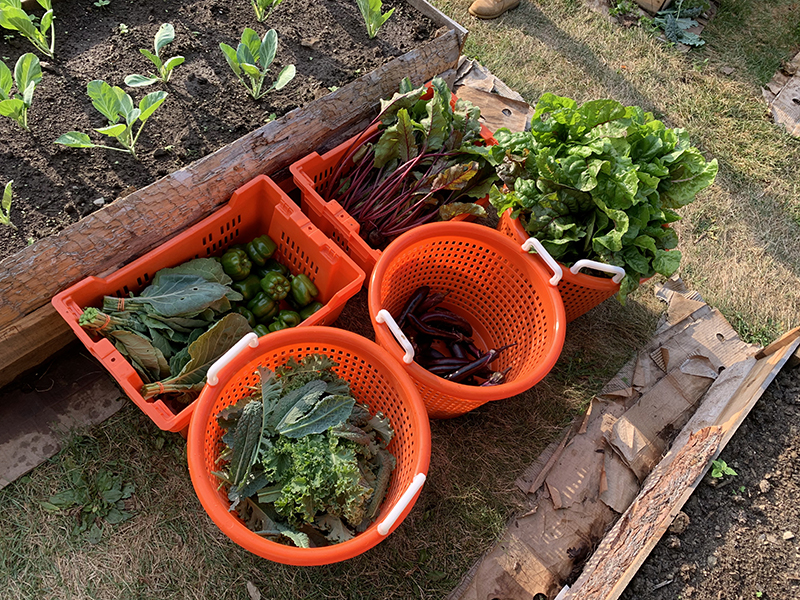
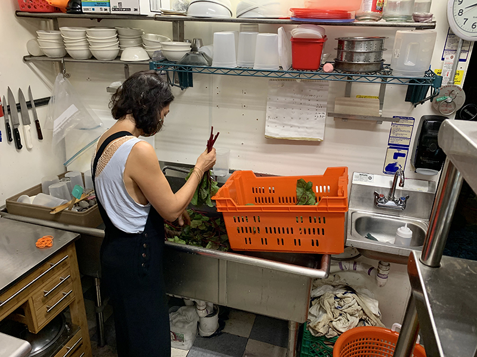
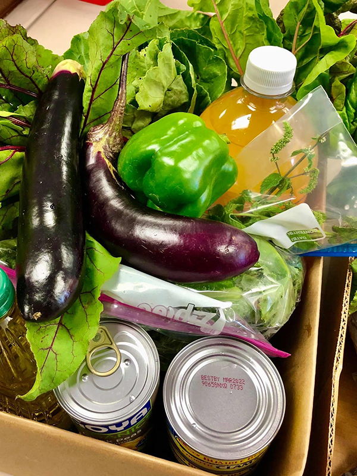
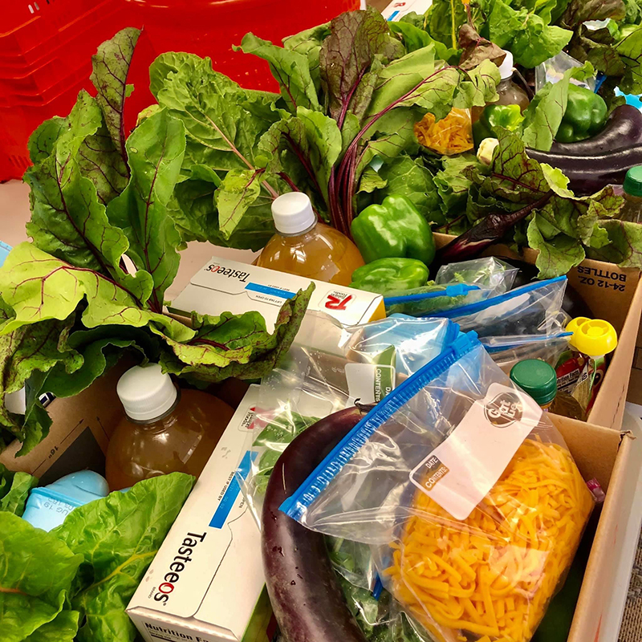

New crops this week! Eggplants and peppers are looking bountiful.

**We donated:**

**13 bunches of chard**

**11 bags of kale**

**3 bunches of collards**

**16 lbs. eggplants**

**12 lbs. peppers**

**12 lbs. loose beets**

**10 bunches of beet greens**

**6 lbs. of gleaned blueberries**

All of this fresh produce went to the [Catskill Community Center Food Shelf](http://www.catskillcommunitycenter.org/food-pantry/), which gave out 16 boxes of whole-diet food yesterday.

**We send out an email every Tuesday to coordinate the Wednesday morning harvest, so stay tuned! [Join our email list here](https://gmail.us18.list-manage.com/subscribe?u=94746e6c6b5541022831953dd&id=1a2ecd69c1).**

