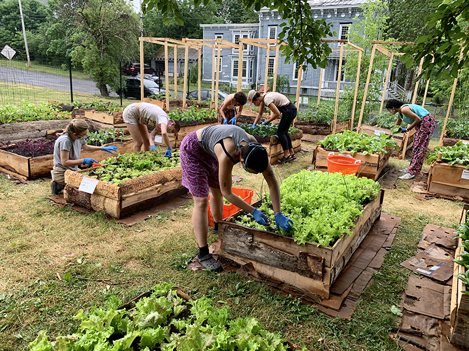
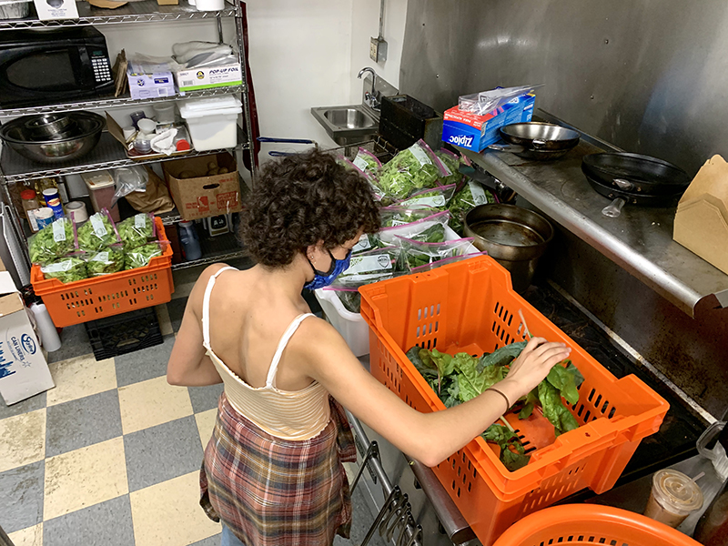
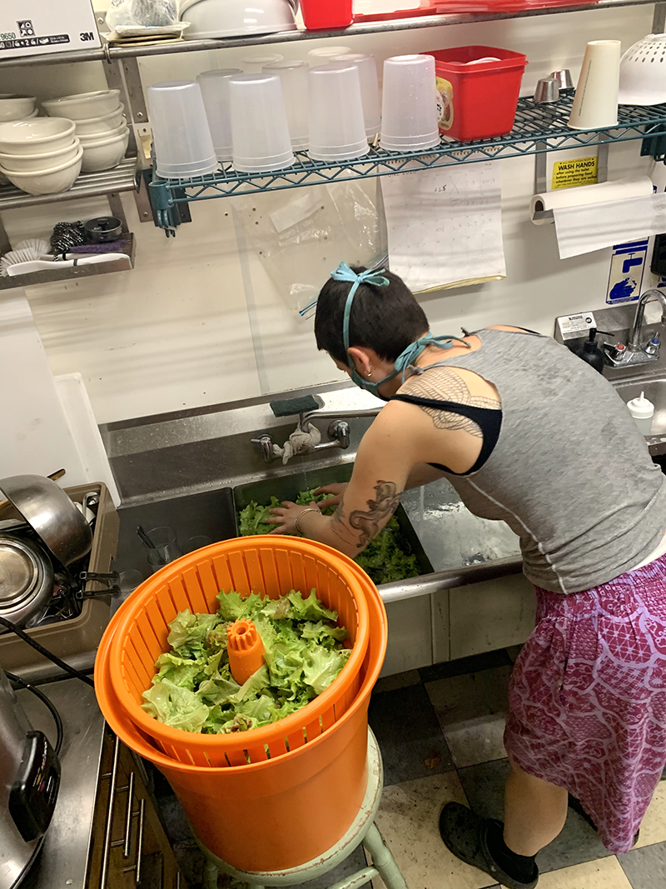
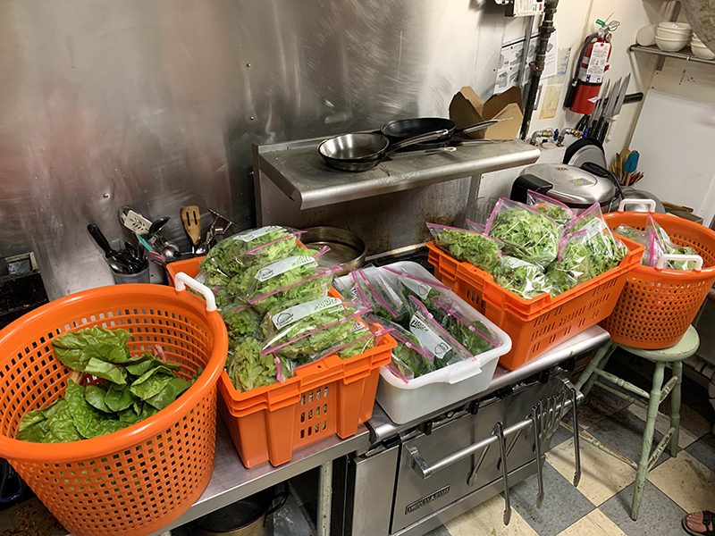

Well, here it is! Our first full harvest of the season, donated to the <a href="http://www.catskillcommunitycenter.org/food-pantry/" target="_blank">Catskill Community Center Food Pantry</a>.

We donated 32 bags of lettuce mix, 13 bags of spinach, 6 bags of loose kale & chard, and 6 bunches of chard.

Big thanks to everyone who came out to harvest, wash and pack - a truly stellar team.

And thanks to <a href="https://theavalonlounge.com" target="_blank">The Avalon Lounge</a>, for allowing us to use their commercial kitchen.

Most importantly, each CCC Food Shelf recipient was able to receive three bags of greens a piece. Let's keep this going!