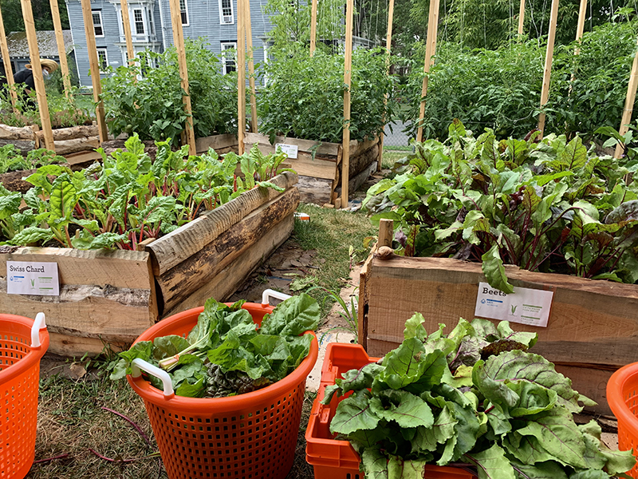

Our fourth harvest has just been donated to the [Catskill Community Center Food Shelf](http://www.catskillcommunitycenter.org/food-pantry/).

We donated 14 bags of kale, 10 bunches of chard, 5 bunches of collards, 9 bunches of beet greens, 10 lbs. of loose beets, and 6 lbs. of eggplants; plus 20 lbs. of blueberries + 8 lbs. strawberries gleaned from an off-site property (big thank you to the folks at [Esme.com](https://ccmicrofarm.us18.list-manage.com/track/click?u=94746e6c6b5541022831953dd&id=ed2b941492&e=ef559ba078) for this continued donation).

Thank you to our volunteers, and to the [Avalon Lounge](https://www.theavalonlounge.com/) for allowing us to wash produce in their commercial kitchen every week.

