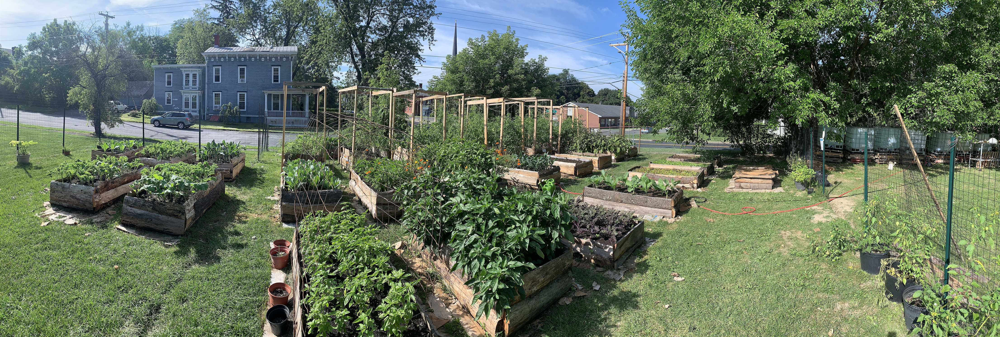

**Donated to the Catskill Food Pantry:**

**32 bunches collards**

**20 bunches kale**

**8 bags greens**

**34 lbs. apples**

**50 lbs. butternut squash (generously donated by [Whistle Down Farm](https://ccmicrofarm.us18.list-manage.com/track/click?u=94746e6c6b5541022831953dd&id=73d89ec66c&e=ef559ba078))**

**We forgot to take photos, so here's a before/after of our garden plants!**

