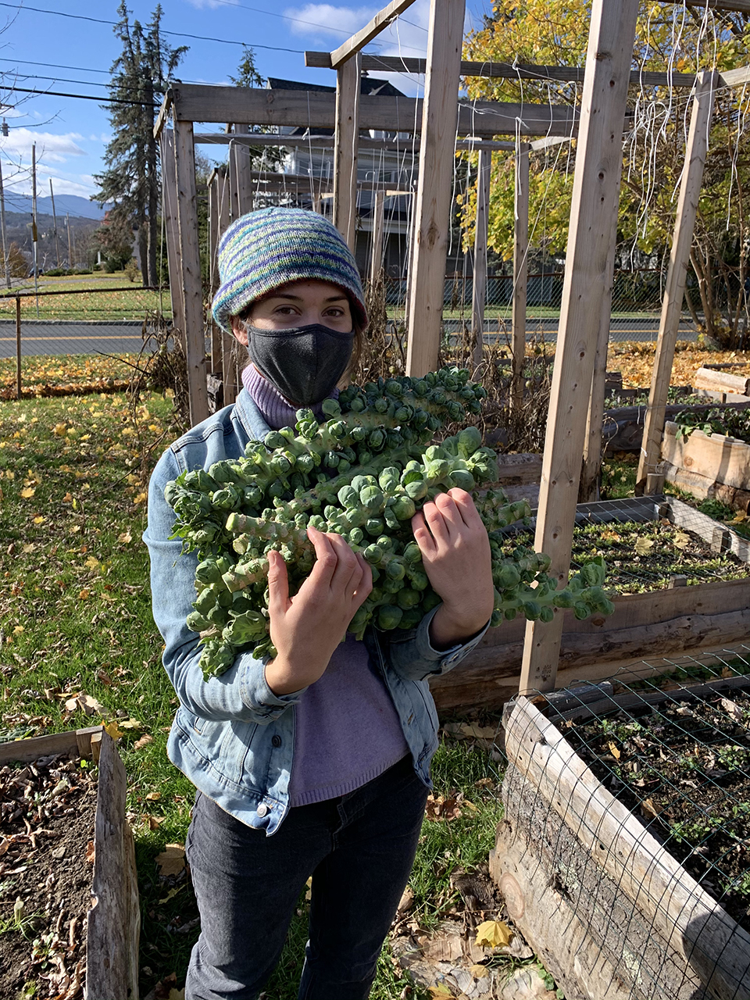
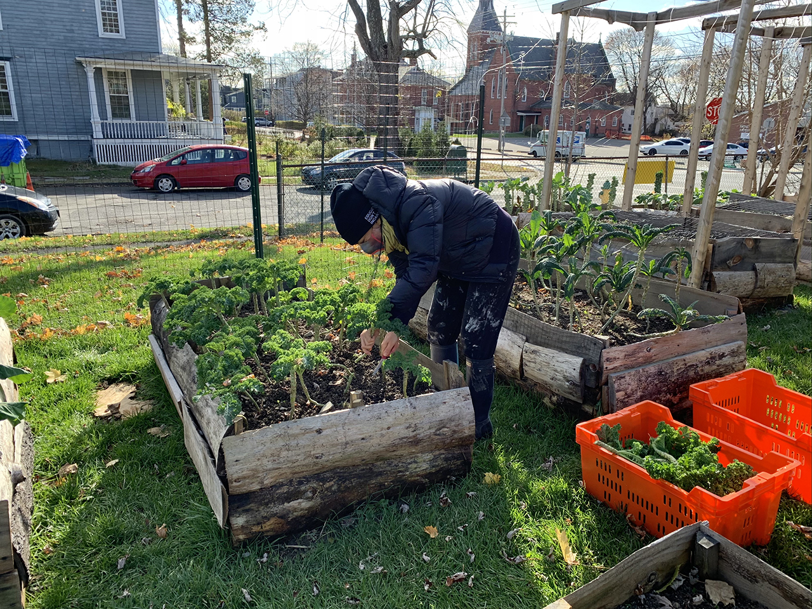
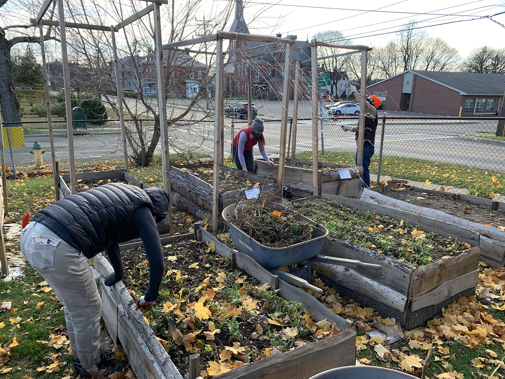
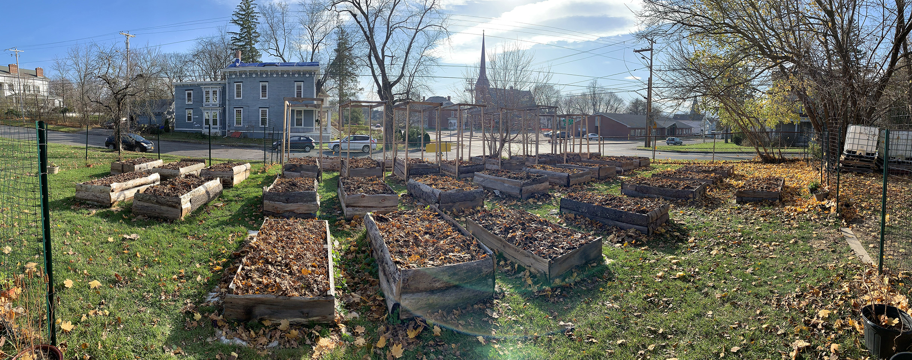

Our last harvest was donated on November 18th - our 20th donation of the season.
Immense gratitude to all who made this project possible!

Donated to the Catskill Food Pantry:

54 stalks of kale

22 stalks collards

11 stalks brussel sprouts

13 lbs. baby beets

Cleanup day was November 19th - all plant stalks were clipped and composted, and leaf mulch was added over the top of each bed
With this coming winter, we are taking a moment to step back and rest. We will be in touch about future planning, which hopefully includes adding some of you as project leaders, more volunteer opportunities, and updates around 1) irrigation 2) nonprofit status and 3) farm infrastructure.

Thanks to all volunteers & donors for such a successful first season - it's been incredible.
Please reach out to us for any reason, just email info@ccmicrofarm.org.

