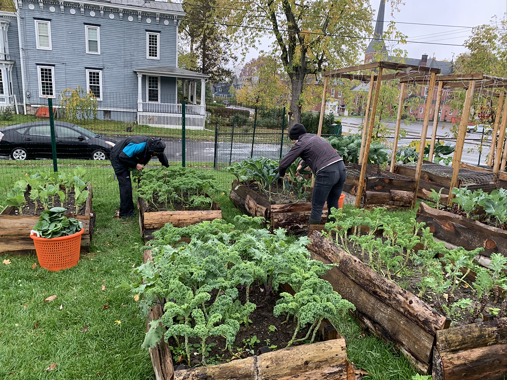
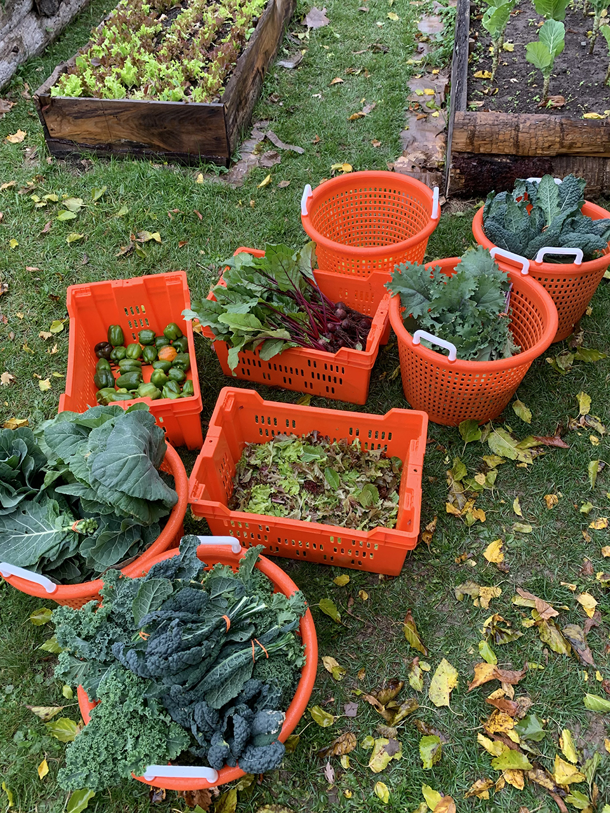
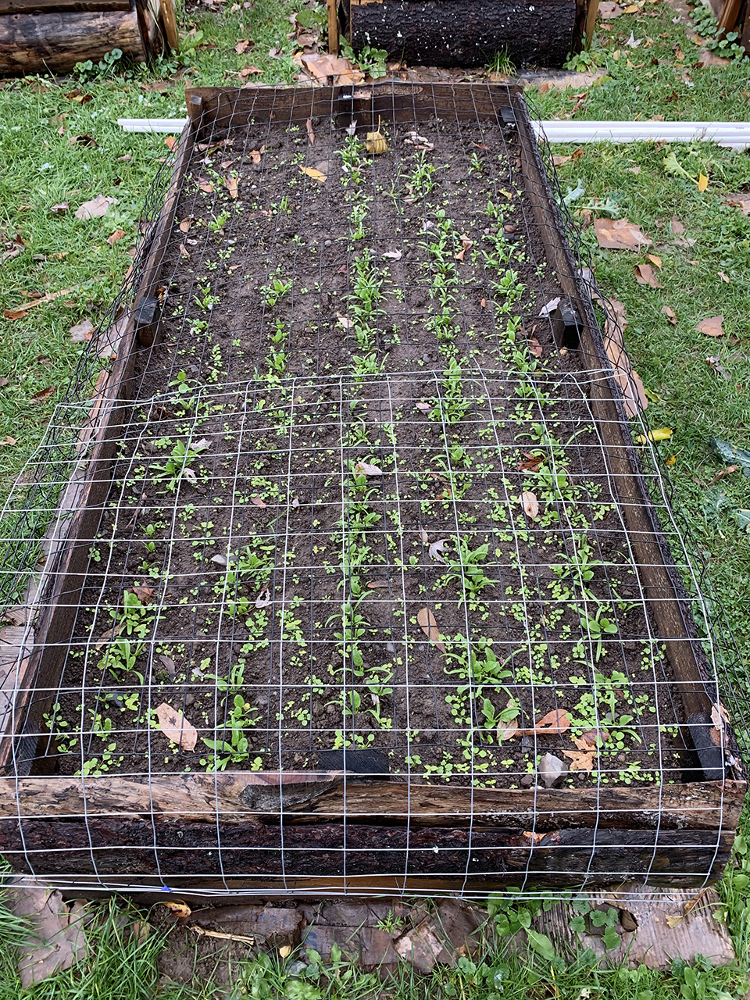
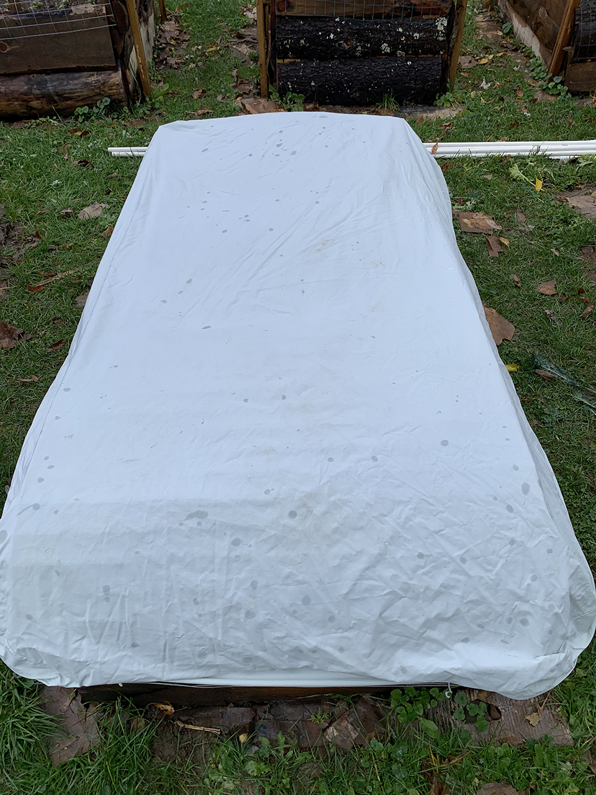

Happy....Winter?
Harvest #19 was donated to the [Catskill Food Pantry](catskillfoodpantry.org) on Wednesday

With this cold spell looming, we harvested as much as possible from our raised beds this week. Delivered to the Catskill Food Pantry:

**45 bunches kale**

**15 bunches collards**

**26 lbs. beets**

**11 lbs. peppers**

**We are going to see how well the plants respond to this cold.** The kale and collards plants which have been producing all year, might not make it through. However, we're covering the new baby greens - spinach and kale - in hopes that we can get more micro green harvests in the future.

So, depending on how it goes, we will let you know if the garden will still need watering for these last 2-3 weeks.

