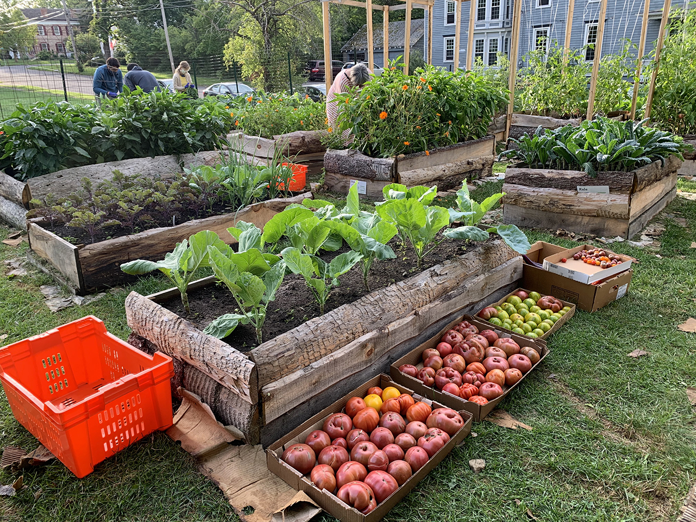
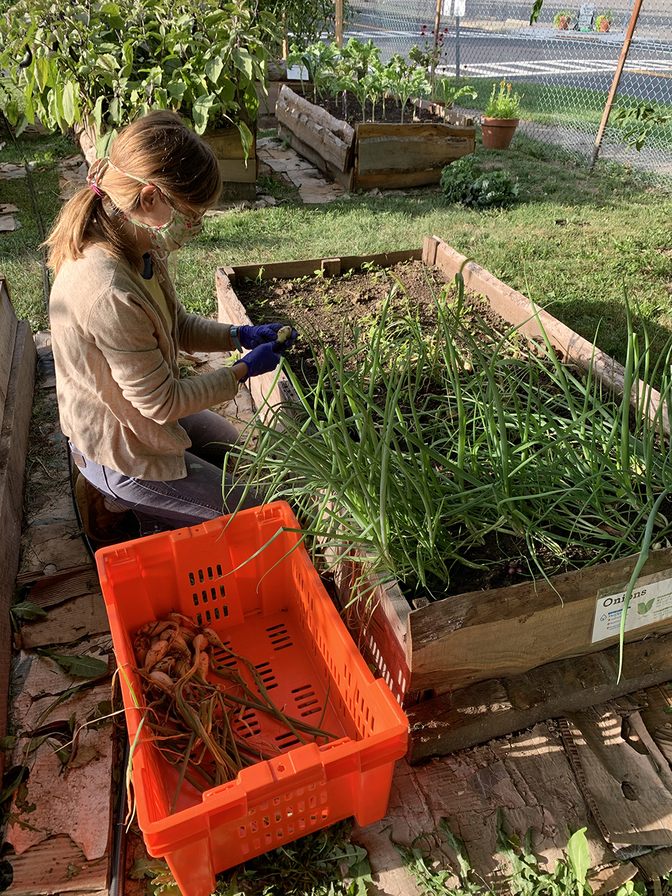
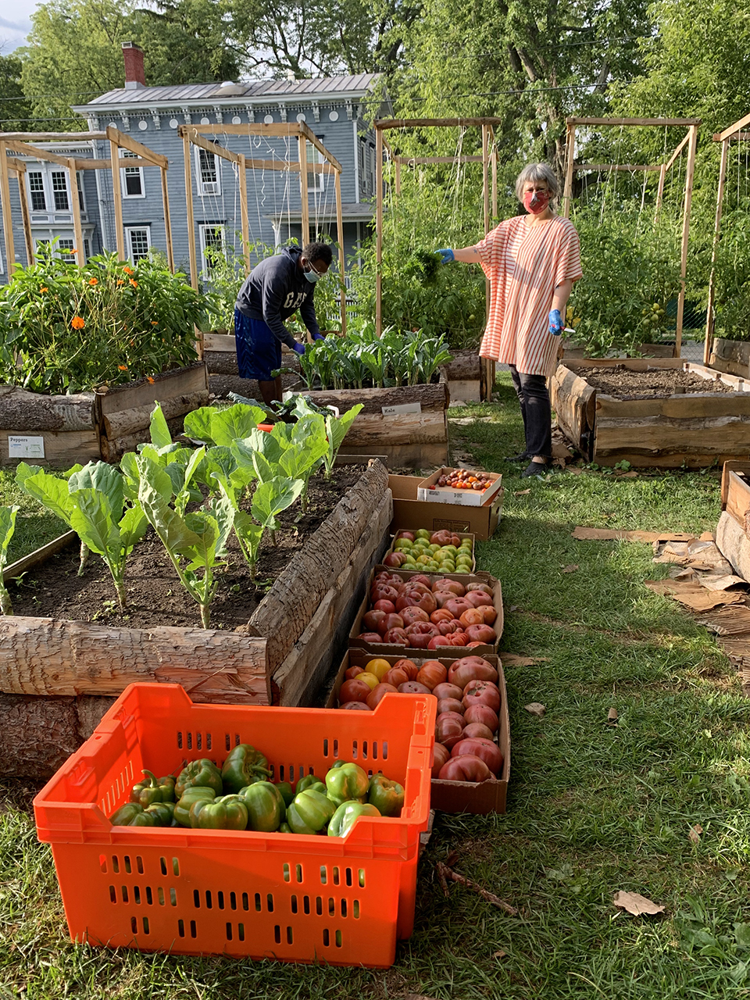
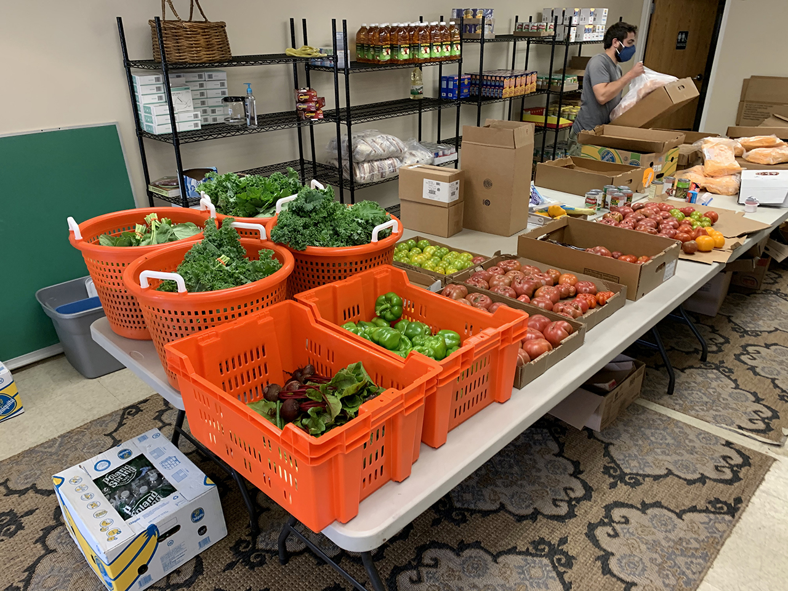

Continued abundance from these beautiful plants! Many thanks to our strong crew of volunteers for these morning harvests and daily watering sessions. It looks like happy veggies out there, going to grateful homes.

Wednesday's harvest, donated to the [Catskill Community Center Food Shelf](http://www.catskillcommunitycenter.org/food-pantry/):

51 bunches kale

15 bunches collards

28 lbs. peppers

22 lbs. tomatoes

8 lbs. beets

15 onions

