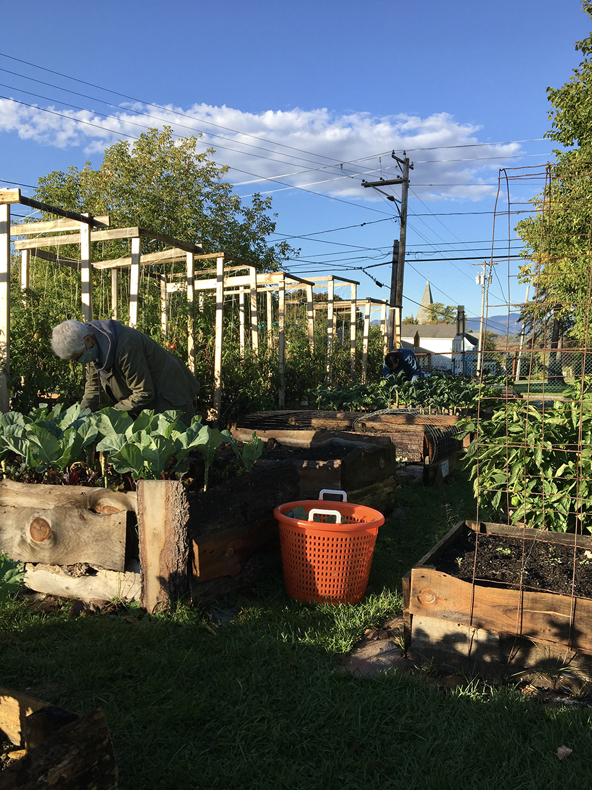
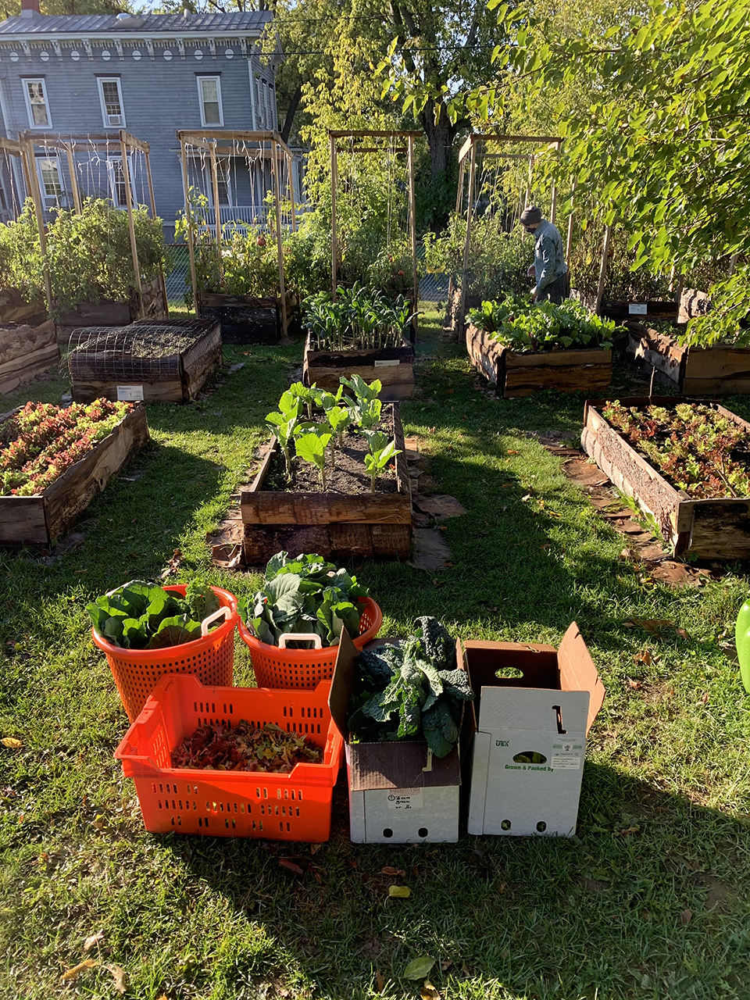
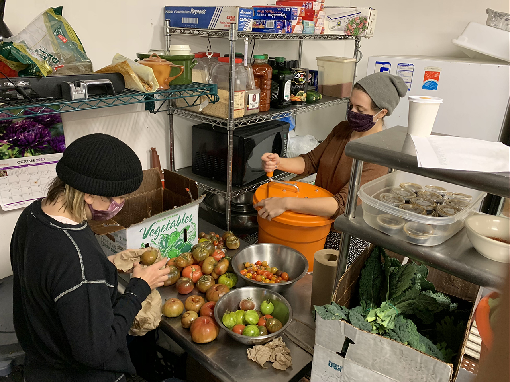

Our 17th harvest was donated to the [Catskill Food Pantry](catskillfoodpantry.org) today. With the colder weather, we are harvesting from most kale and collard plants every other week, so this week was a big one!

**We donated:**

**38 bunches collards**

**23 bunches kale**

**10 bags micro greens**

**6 bags beet greens**

