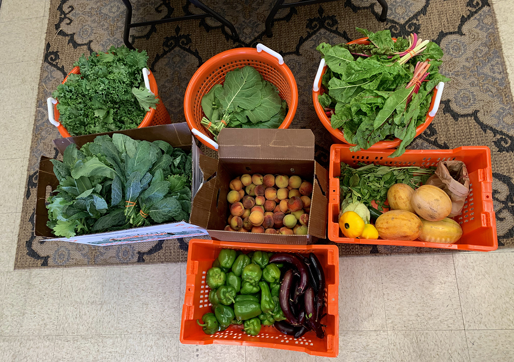
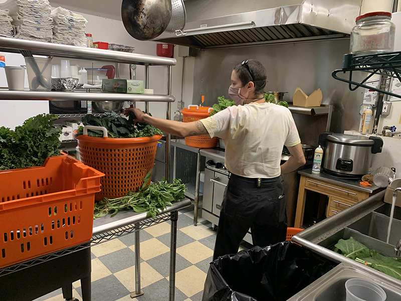
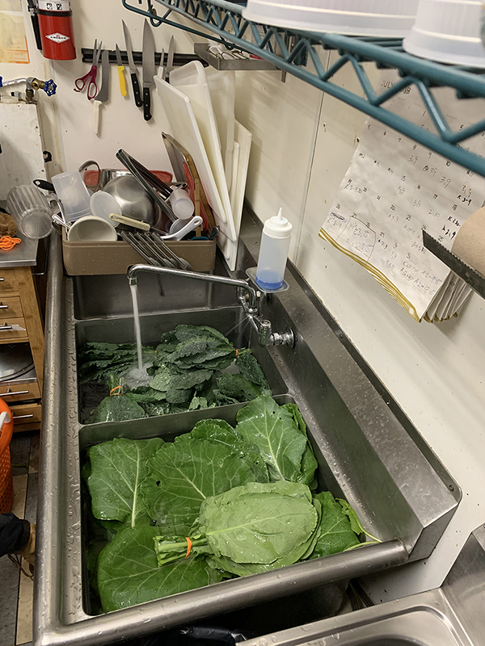
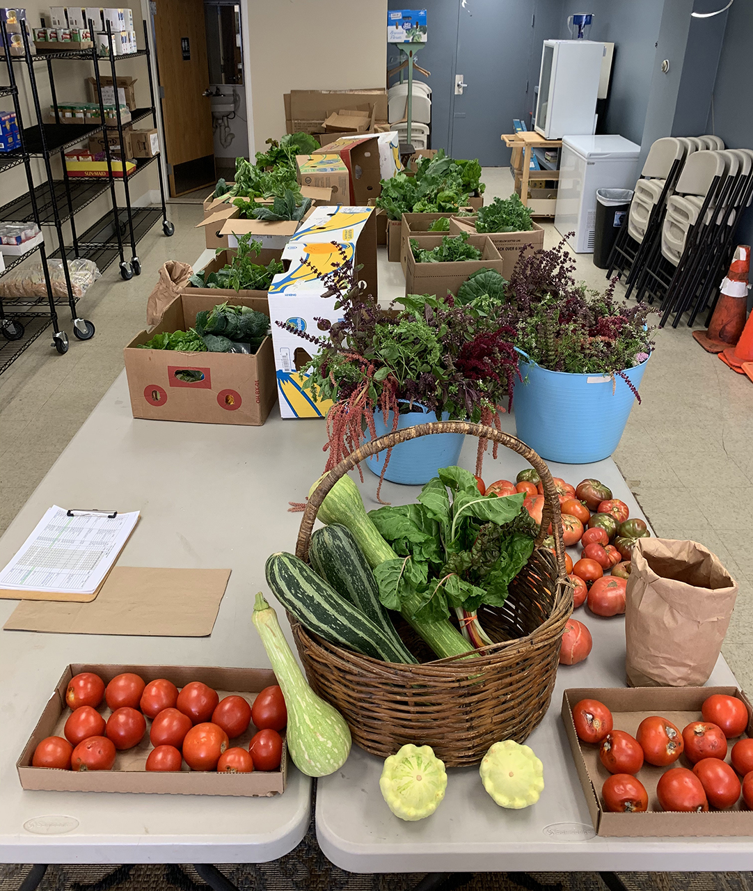

**Wow! Tomatoes are in season, and our new greens are flourishing.**

Yesterday's harvest, donated to the [Catskill Community Center Food Shelf](https://ccmicrofarm.us18.list-manage.com/track/click?u=94746e6c6b5541022831953dd&id=ceb474bdfc&e=ef559ba078):

**53 (yes, 53!) bunches kale**

**13 bunches collards**

**14 bunches chard**

**24 lbs. tomatoes**

**17 lbs. peppers**

**15 lbs. eggplant**

**22 lbs. peaches + 10 lbs. melons (gleaned)**

**some basil to go with the tomatoes**

