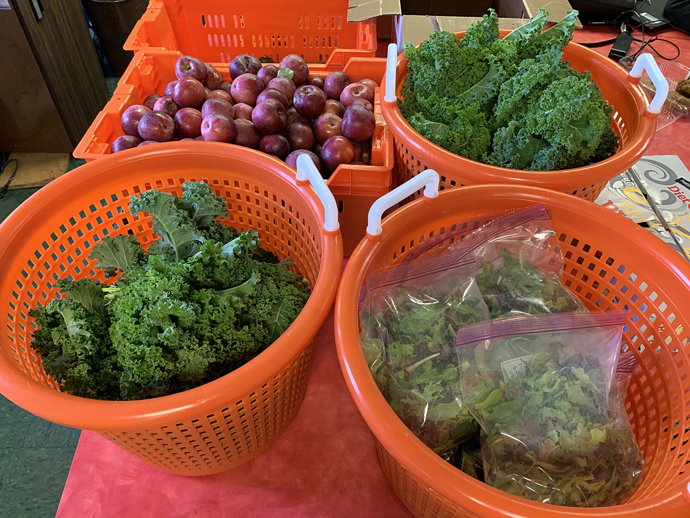

We completed our 16th harvest yesterday! With fall weather in full effect, crop yields are slowing and we are beginning to stagger harvests between crops and beds of crops.

**Donated to the Catskill Food Pantry:**

**30 bunches kale**

**12 bags micro greens mix**

**10 lbs. pepper**

**6lbs. tomatoes**

**32 lbs. apples via volunteer picking**

**The Catskill Food Pantry is raising $6000 via GoFundMe - [please donate here](gofundme.com/catskillfoodpantry)!** Money will go toward their Fall/Winter operating expenses, when the need for food pantries is high and fresh produce donations are low.

