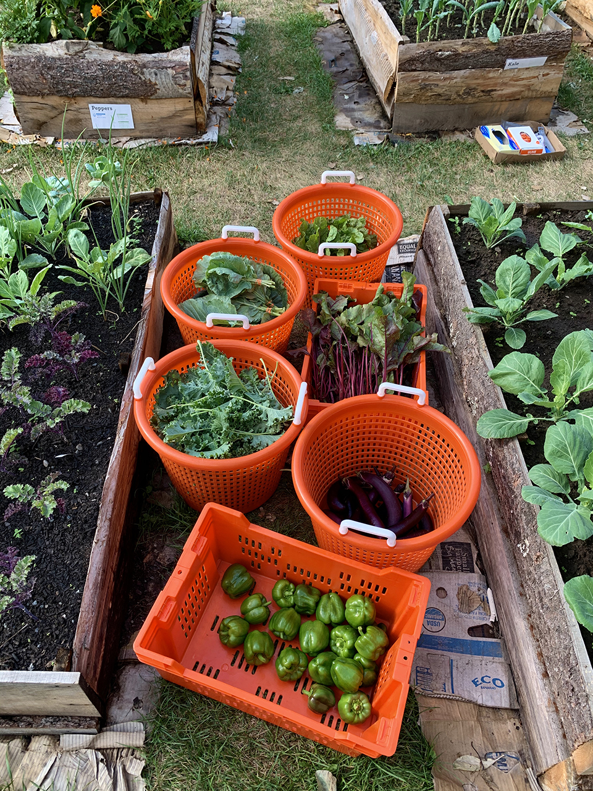
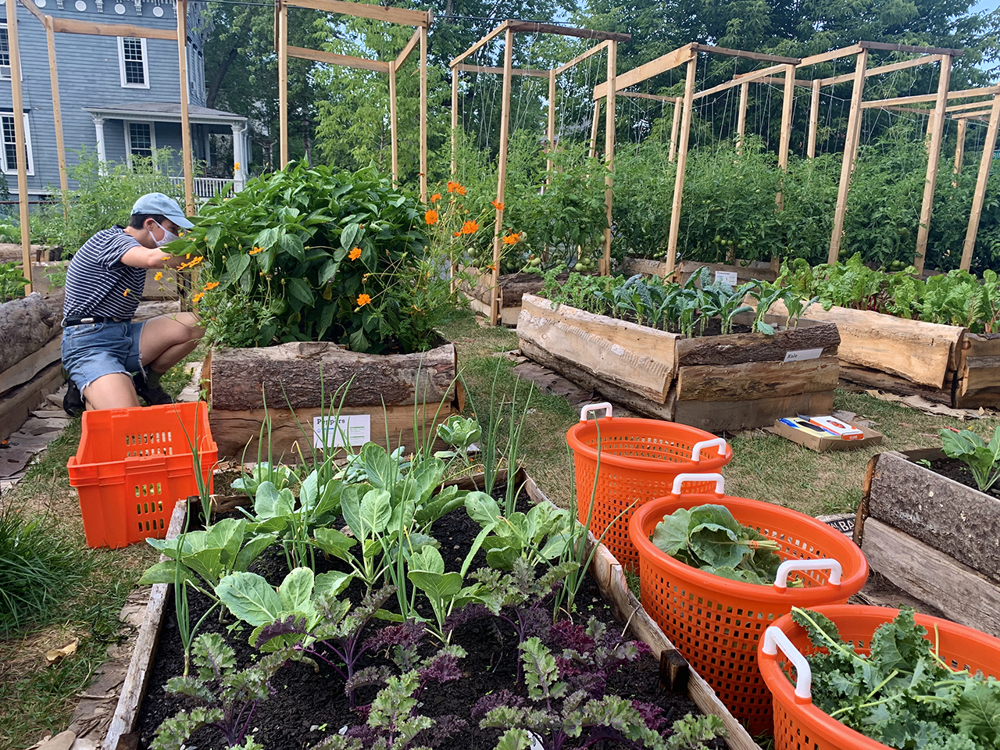
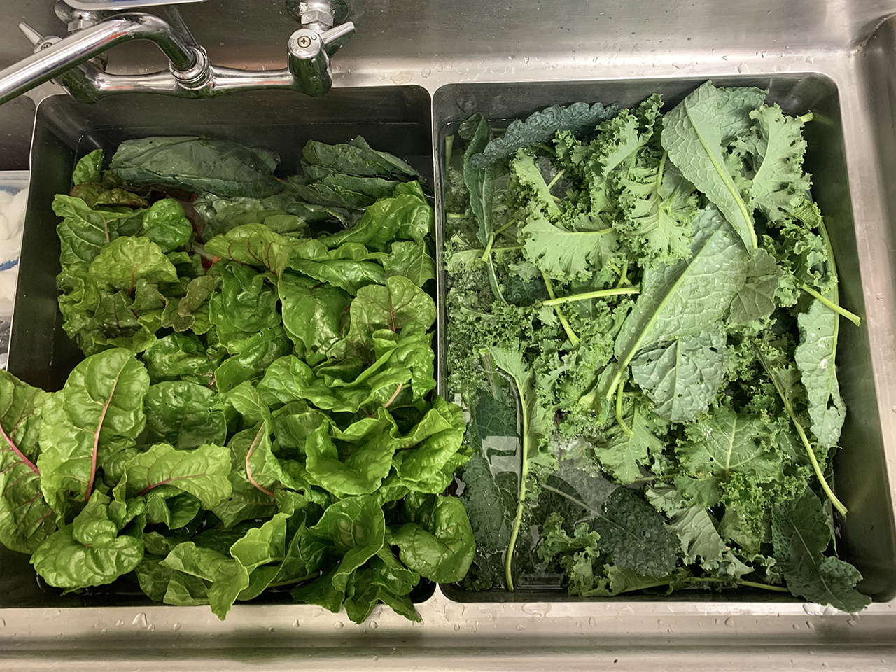
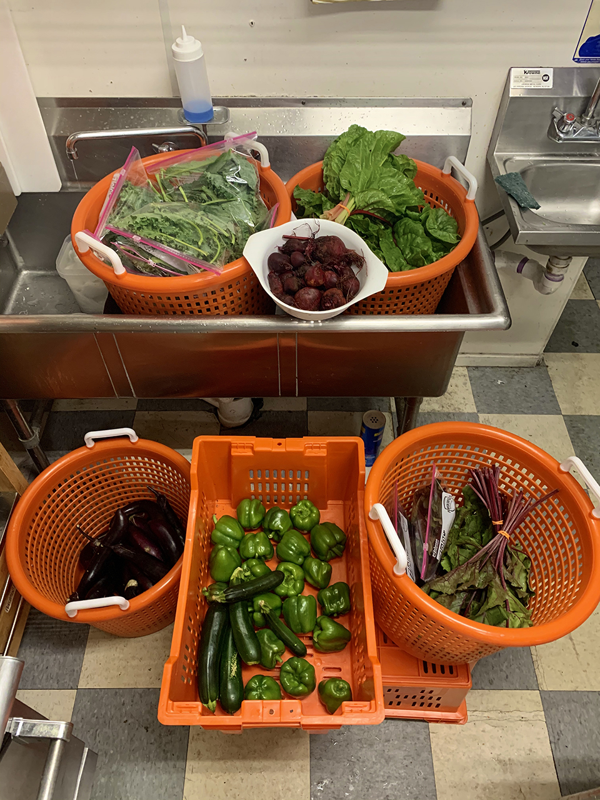
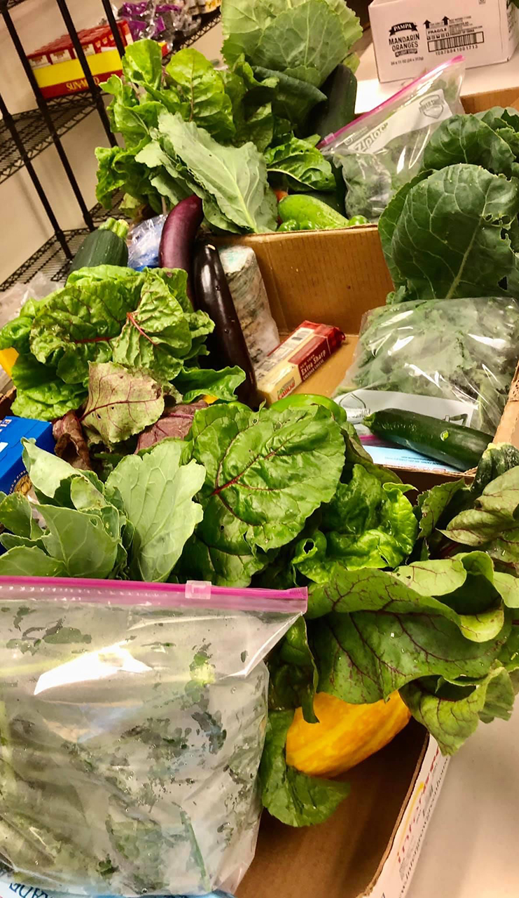

Our sixth harvest has been donated to the Catskill Community Center!

**12 bags kale**

**15 bunches collards**

**8 bunches chard**

**6 bunches + 2 bags beet greens**

**18 lbs. eggplant**

**11 lbs. peppers**

**8 lbs. beets**

**9 lbs. tomatoes**

**6 lbs. zucchini**

