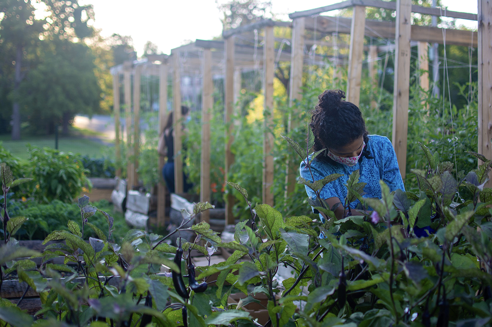
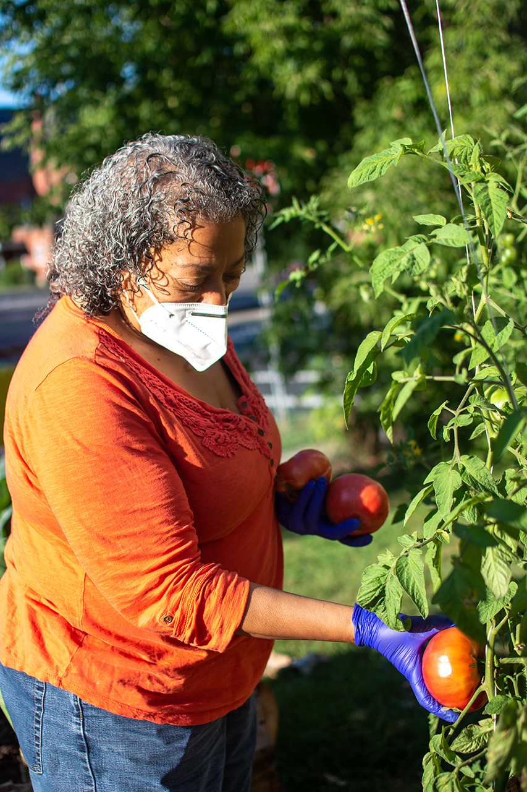
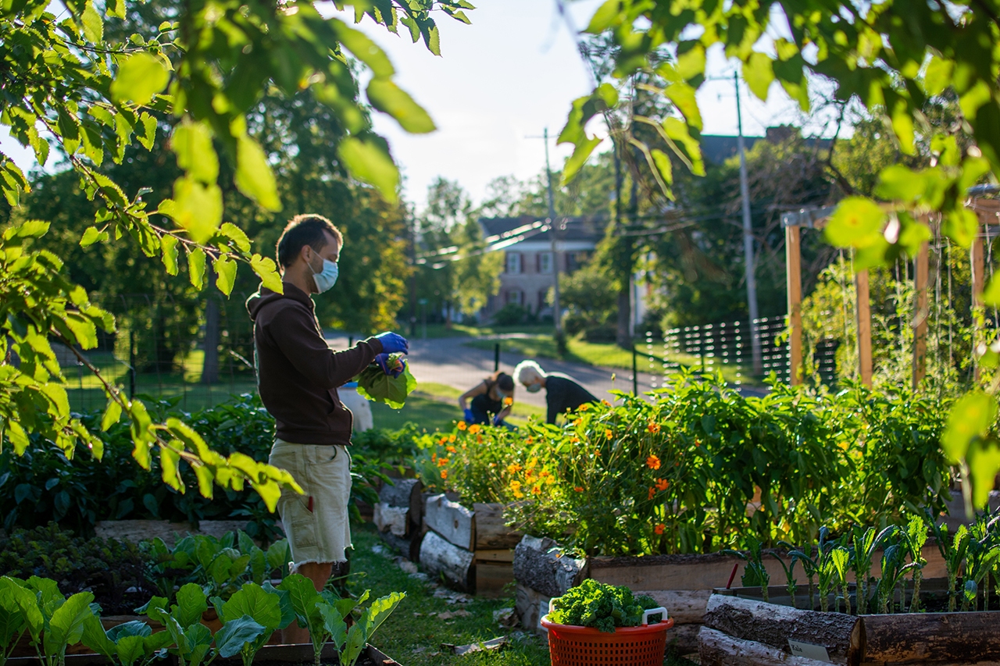
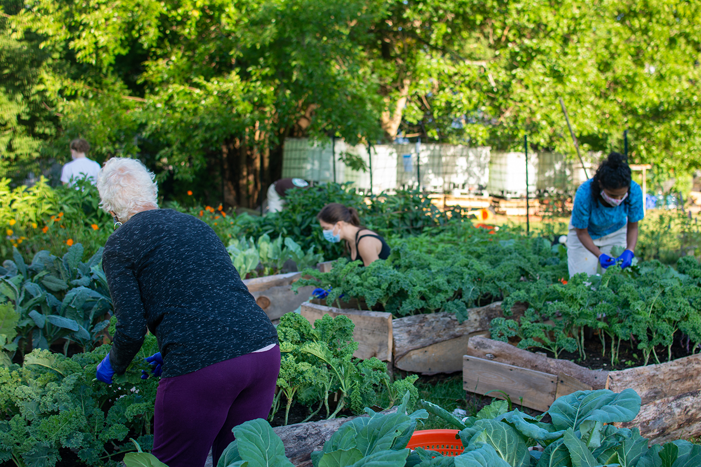
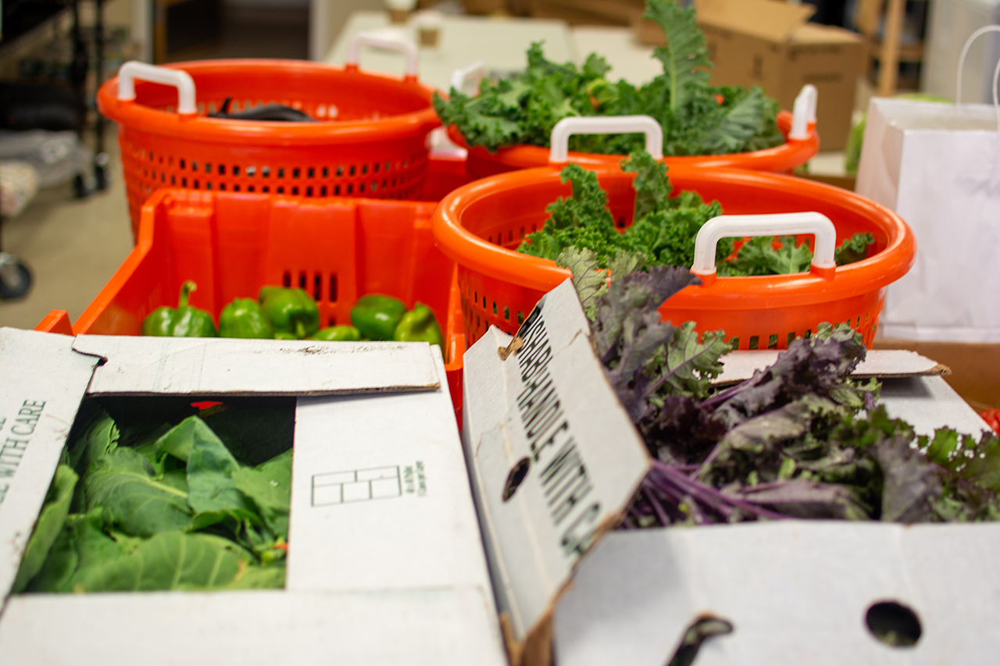
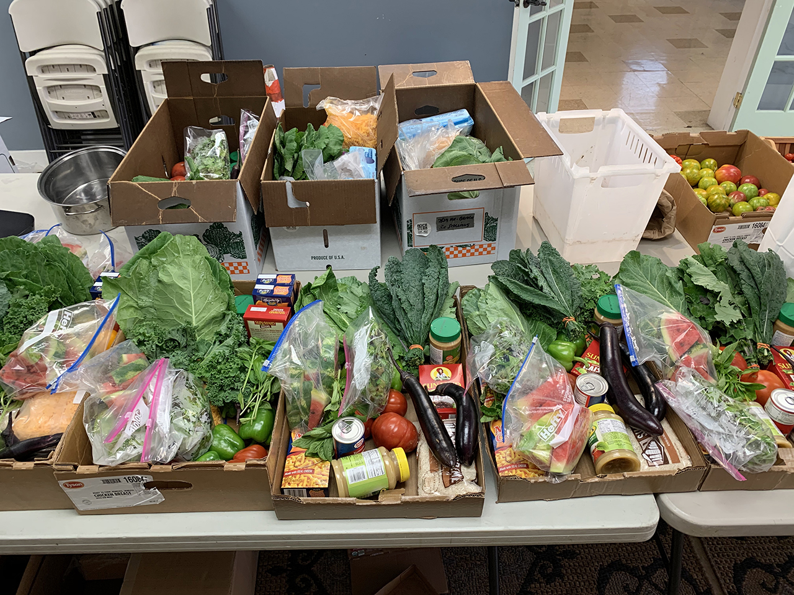

We have reached a small milestone - if only significant in terms of its numeric difference, our tenth harvest serves as an impetus for us to consider the longevity this project requires. 10 weeks of donating fresh produce to food pantries is an accomplishment to be built upon! And we are grateful for the continued enthusiasm and support as we grow and build.

This week, we donated the majority of our produce to the **[Catskill Community Food Shelf](https://www.catskillcommunitycenter.org/food-pantry/)**. As the hours of their food pantry came to a close and everyone had showed up, there was an excess of kale and collards bunches, which were delivered to **Community Action of Greene County's Emergency Food Pantry.**

**78 bunches of green curly, lacinato, red russian kale + 15 stalks red curly kale\
37 bunches collards\
18 bags of lettuce/kale/arugula micro greens mix\
26 lbs. eggplant\
22 lbs. tomatoes\
18 lbs. peppers\
32 sprigs basil\
10 lbs. peaches\
3 large watermelons, cut into pieces and bagged**

