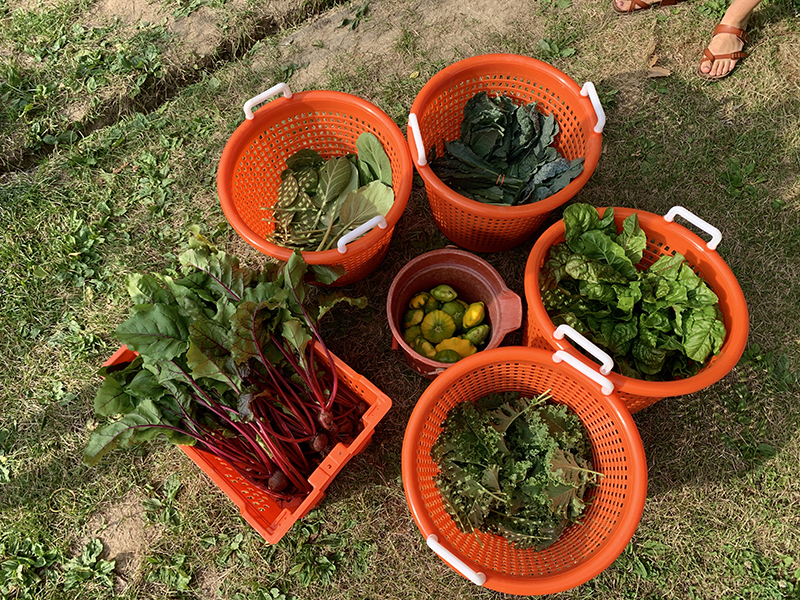
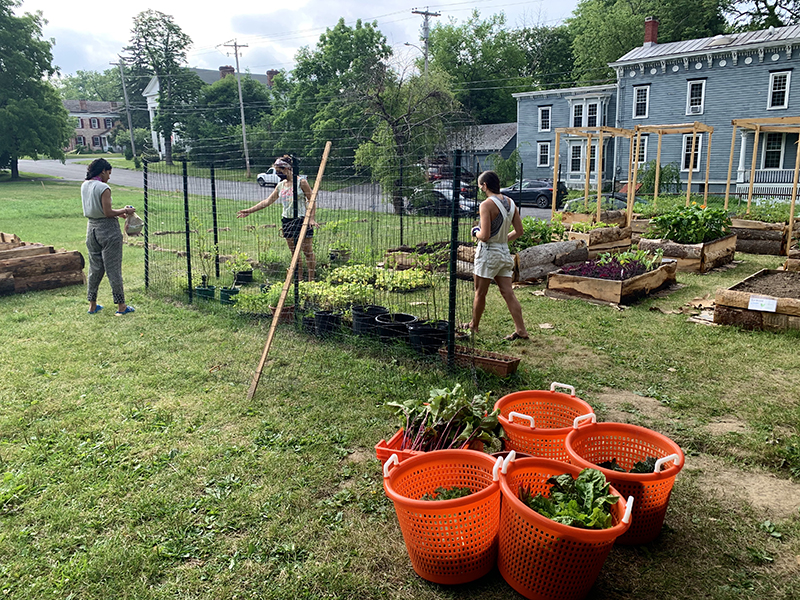
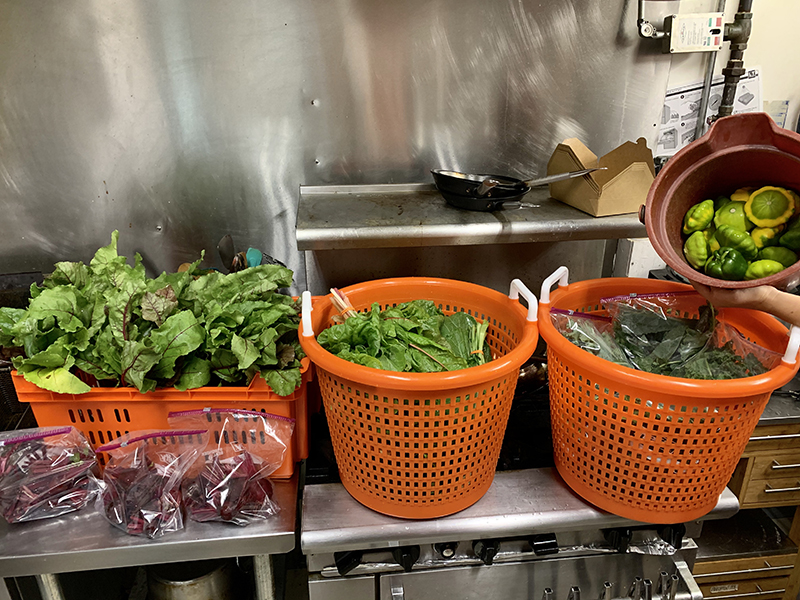
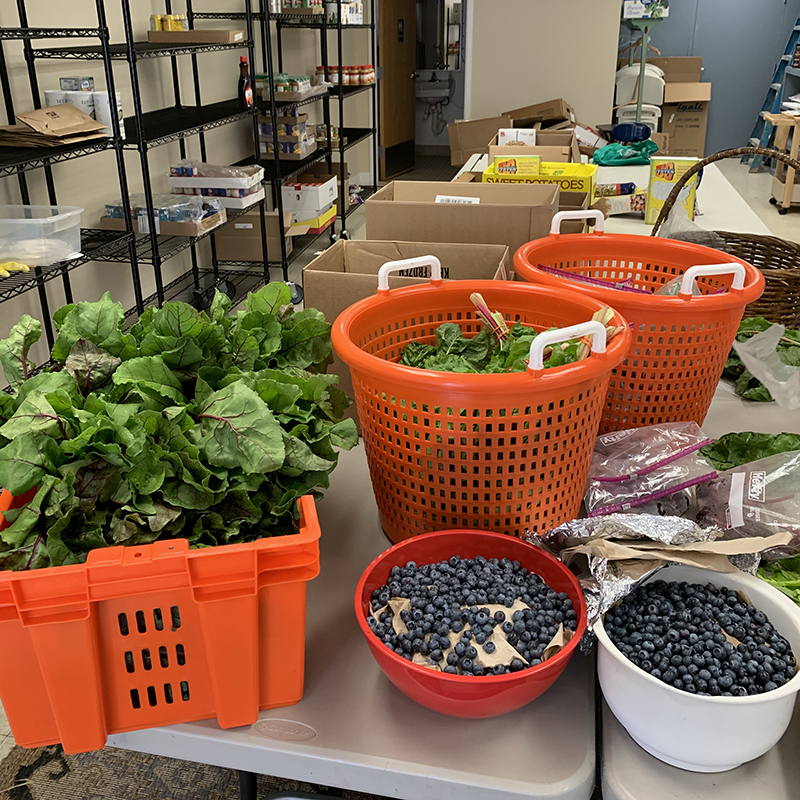

**We donated 10 bunches of chard, 8 bags + 5 bunches of kale, 10 lbs. of beets, 10 bags of beet greens, and 8 lbs. of blueberries (gleaned from an off-site property) to the [Catskill Community Center Food Shelf](http://www.catskillcommunitycenter.org/food-pantry/). We're so happy to see fresh food going to the folks who need it most.**

**And Update on Plants**

We currently have a few beds empty, as all our lettuce bolted in the summer heat. We are looking for lettuce starts, kale, chard, and collards, as we plan for fall crops. **Please reply to info@ccmicrofarm.org if you have any plant starts leads - either donated or purchased!**