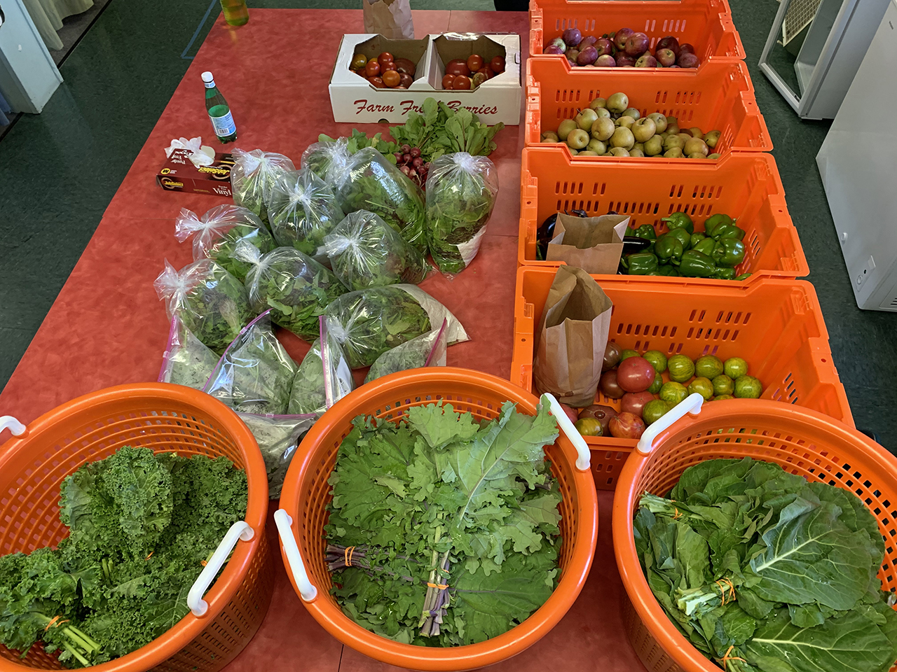
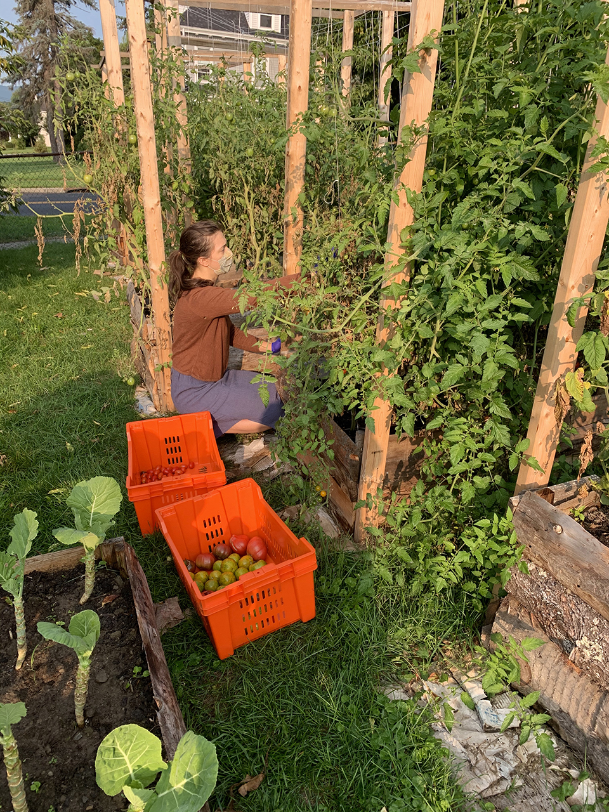
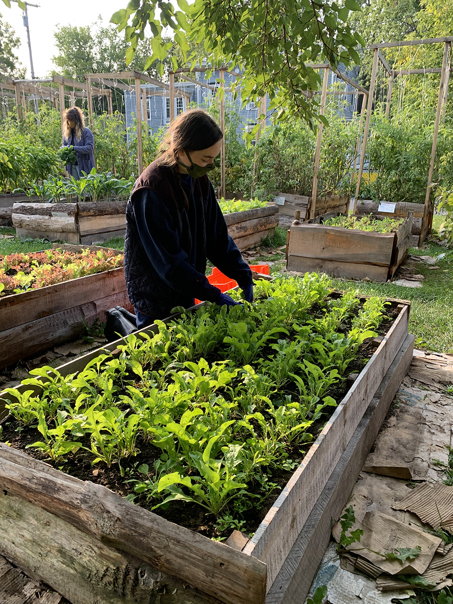
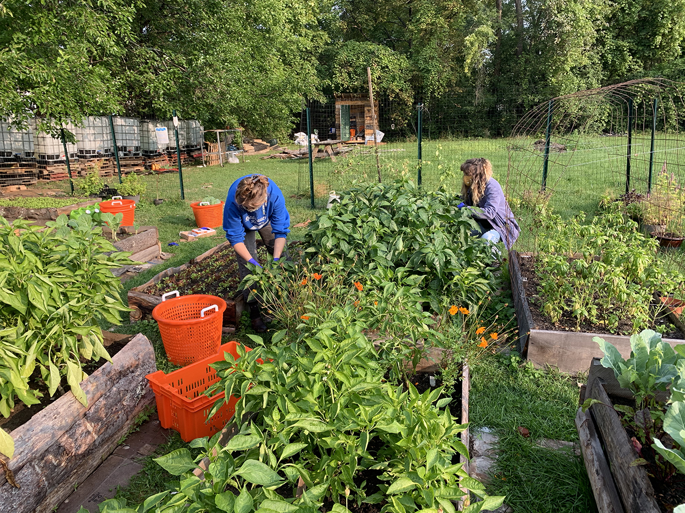

Our 13th harvest of the season goes to the newly formed Catskill Food Pantry! Follow them on [Facebook](https://www.facebook.com/catskillfoodpantry) or check out their [website](http://catskillfoodpantry.org) for more info.

16 bunches collards

28 bunches kale

15 bags mixed greens

18 lbs. tomatoes

9 lbs. peppers

20 lbs. pears

14 lbs. apples

