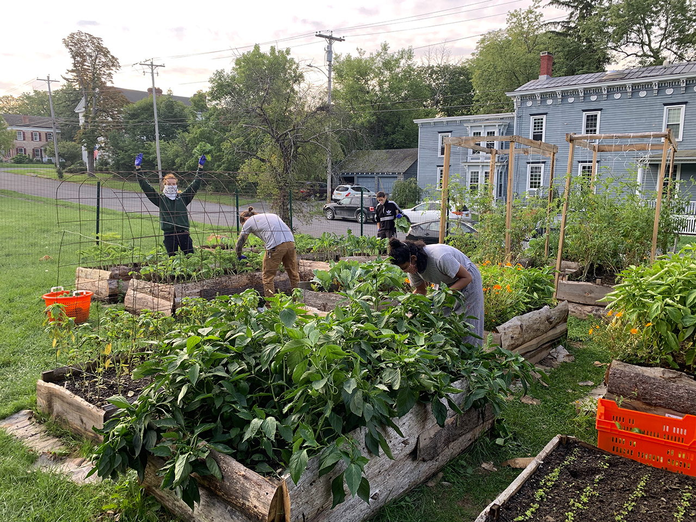
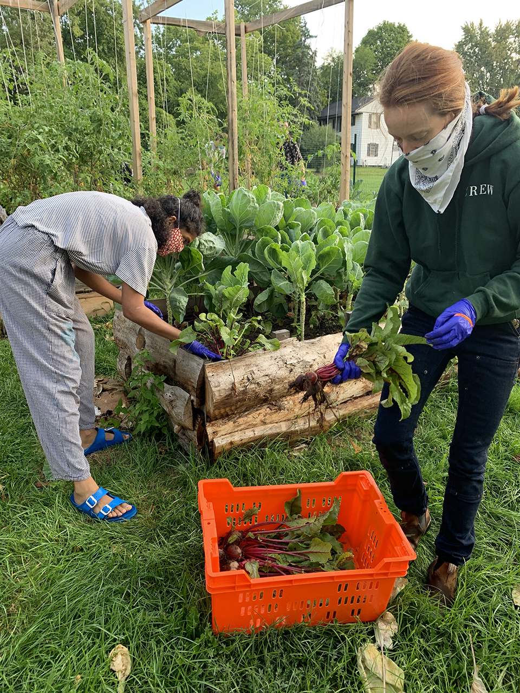
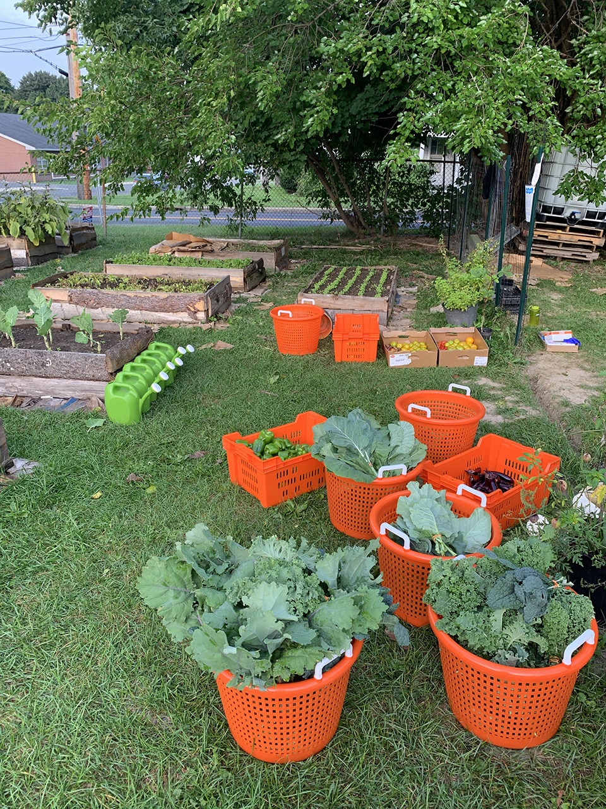
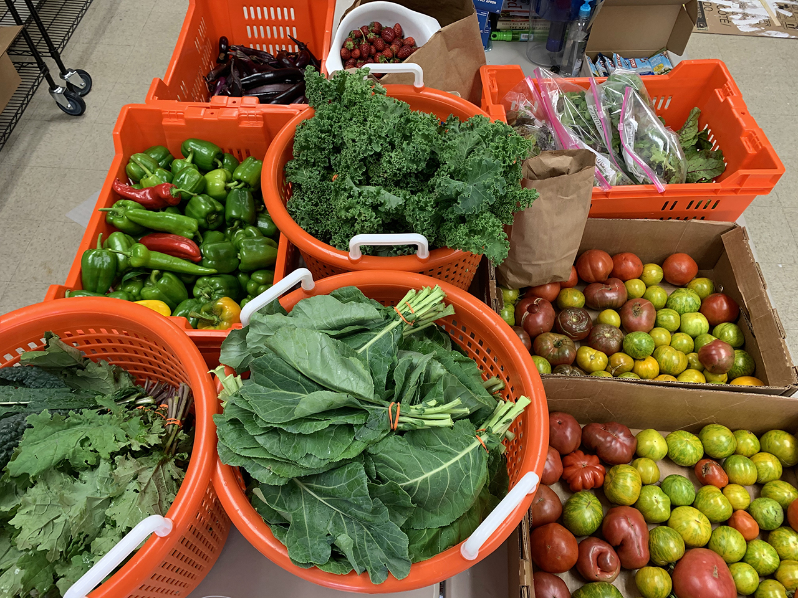

This past Wednesday marked our final donation to the Catskill Community Center Food Shelf, which is now closed.\
\
Megan Henry has formed a new organization, the [Catskill Food Pantry](http://catskillfoodpantry.org/), which will be open on Wednesdays between 1:30pm-6pm at St. Luke's Episcopal Church on William Street. The Community Center is donating fridges, freezers, and shelving to the Catskill Food Pantry to aid its effort.

Our final donation to the **Catskill Community Food Shelf** yesterday:

**33 bunches green curly, lacinato, and red russian kale**

**32 bunches collards**

**27 lbs. peppers**

**11 lbs. eggplant**

**12 lbs. tomatoes**

**6 bags micro greens**

**8 lbs. beets**

