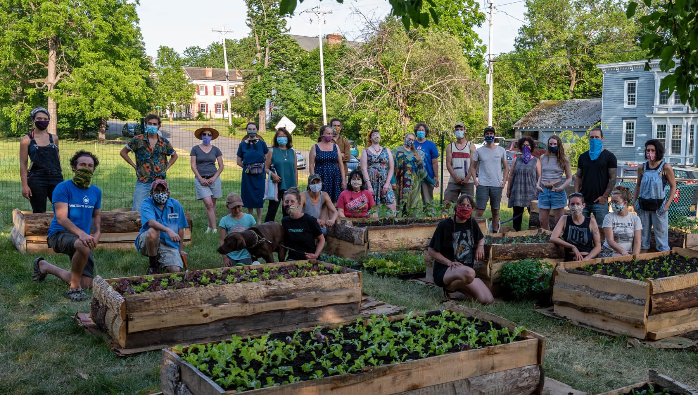

**Hello, and welcome to Catskill Community Micro Farm**! 

Conceived in May of 2020, our aim is to grow fresh food to donate to our local pantries, beginning with Mathew 25 and the Catskill Community Center.

Working on an acre (and change) of land generously donated through St. Patricks Parish, we’ve begun transforming [an underutilized lot on the corner of William and Spring Street in Catskill, NY](https://goo.gl/maps/RLiLz5aHTGSXENav7),  into a fully producing micro farm. 

We are completely volunteer run, with all encouraged to sign up, participate, and lend their strengths to this journey. Don’t think you have a green thumb? That’s ok, we’ll teach you all you need to know! You can also lend a hand in our Infrastructure Team ( helping with maintenance and building projects) or dive in to our Outreach Division (connecting with the community and finding out what people really want to eat). Don’t think you have skills to offer? That’s ok, too! Perhaps you’d like to use your truck for a day of errands, or be a part of our distribution network at the time of harvest… 

Or, perhaps you know of some spare tools, equipment, or compost that someone isn’t using.. As a group of individuals, and not a business, we’re heavily reliant on donations, so please consider connecting us to folks who might have things to spare.

If you’ve got some time and a desire to get involved we’ll find a niche that suits your talents!

Digging into our first season, there’s much work to do as we design our beds, build our toolshed, turn sod, till, plant, weed, water, mulch, irrigate, build a fence, and all the other tasks that accompany the production of body, mind, and soul nourishing food for years to come. 

If you’d like to get involved, please fill out our [sign up form](https://forms.gle/uWkdaTd5AecLJcf5A), and don’t hesitate to [reach out](mailto:info@ccmicrofarm.org).  We’re open to ideas, evolution, and collaboration from across the board.

This isn’t just our space, it’s your space also.

We look forward to meeting you!