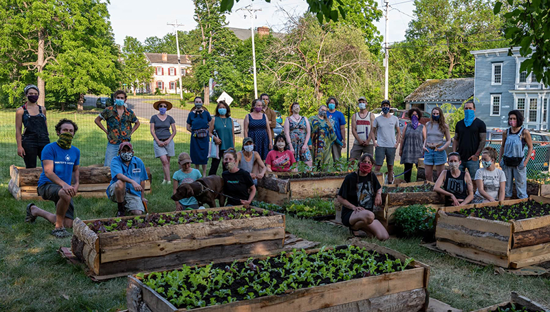

**Hello, and welcome to Catskill Community Micro Farm**! 

Conceived in May of 2020, our aim is to grow produce for donation to local food pantries, addressing the shortage of healthy, fresh food in the pantry system. We are beginning with donations to the Catskill Community Center Food Shelf, and Matthew 25.

Working on an acre of land generously donated by the St. Patrick's Parish, we’ve begun transforming [an underutilized lot on the corner of William and Spring Street in Catskill, NY](https://goo.gl/maps/RLiLz5aHTGSXENav7) into a fully producing micro farm. We are currently harvesting enough fresh produce to supply 20-25 families each week.

We are completely volunteer run, with all encouraged to [sign up](https://gmail.us18.list-manage.com/subscribe?u=94746e6c6b5541022831953dd&id=1a2ecd69c1), participate, and lend their strengths to this project. Don’t think you have a green thumb? That’s okay, we’re happy to teach you! Our farm work days are always include team leaders delegating tasks and teaching anyone who wants to develop their skill set.

We currently rely on volunteers to water our raised beds by hand - [join our email list](https://gmail.us18.list-manage.com/subscribe?u=94746e6c6b5541022831953dd&id=1a2ecd69c1), and we will send you the watering sign up information.

You can also lend a hand in our Infrastructure Team (maintenance and building projects), or our Outreach Division (connecting with the community and finding out what people really want to eat, and how to get it to them). 

As a group of individuals, and not a business, we’re heavily reliant on donations, so please consider connecting us to folks who might have things to spare in the way of farm equipment or plant starts.

If you’d like to get involved, please fill out our [sign up form](https://forms.gle/uWkdaTd5AecLJcf5A), and don’t hesitate to [reach out](mailto:info@ccmicrofarm.org).  We’re open to ideas, evolution, and collaboration across the board.

This isn’t just our space, it’s your space also.

We look forward to meeting you!